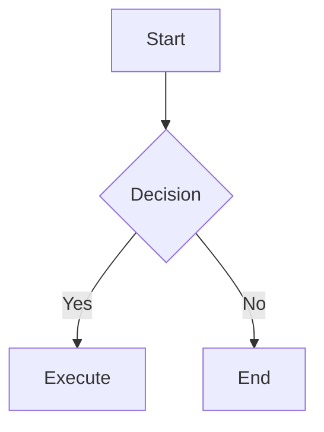
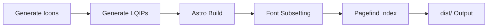

<p align="center">
  
  
  
  
  
</p>

<h1 align="center">🍁 Feng Yu / 枫语</h1>

<p align="center">
  <strong>AI · Reinforcement Learning · Causal Inference · LLMs</strong>
</p>

<p align="center">
  A personal tech blog focused on cutting-edge AI research — sharing algorithms, engineering practices, and academic insights.
</p>

---

## ✨ Features

<table>
  <tr>
    <td width="50%">
      <h4>📝 Content</h4>
      <ul>
        <li>Markdown / MDX hybrid writing</li>
        <li>KaTeX math rendering (with mhchem extension)</li>
        <li>Mermaid & PlantUML diagrams</li>
        <li>Expressive Code syntax highlighting (line numbers / collapsible / language badge)</li>
        <li>GitHub repo card embedding</li>
        <li>Image grid layout</li>
        <li>Auto reading time estimation</li>
        <li>Article excerpt extraction</li>
        <li>Encrypted posts (password protection)</li>
        <li>Post pinning & draft mode</li>
      </ul>
    </td>
    <td width="50%">
      <h4>🎨 Visual</h4>
      <ul>
        <li>🌗 Light / Dark / System theme modes</li>
        <li>🎨 Dynamic theme color (hue picker)</li>
        <li>🖼️ Background wallpaper (banner / fullscreen / overlay)</li>
        <li>🌸 Cherry blossom falling effect</li>
        <li>🧸 Live2D / Spine mascot</li>
        <li>🔤 Custom fonts (built-in Google Fonts stack)</li>
        <li>🎴 Card style (border shadow / theme color)</li>
      </ul>
    </td>
  </tr>
  <tr>
    <td>
      <h4>🌐 i18n & Pages</h4>
      <ul>
        <li>🌍 5 languages: zh_CN / EN / JA / RU / zh_TW</li>
        <li>📄 Homepage with infinite pagination</li>
        <li>🗂️ Archive / Categories / Tags browsing</li>
        <li>🔍 Site-wide Pagefind static search</li>
        <li>📡 RSS feed</li>
        <li>🖼️ OG image generation (Satori)</li>
        <li>📷 Photo gallery (masonry layout)</li>
        <li>👥 Friends page</li>
        <li>💬 Guestbook</li>
        <li>💰 Sponsor page</li>
      </ul>
    </td>
    <td>
      <h4>🔧 Interactive & Integrations</h4>
      <ul>
        <li>🔄 SPA-like page transitions (Swup.js)</li>
        <li>💬 Giscus comments (GitHub Discussions)</li>
        <li>🎵 Meting music player (NetEase / QQ Music etc.)</li>
        <li>📊 Multi-platform analytics (GA / Clarity / Umami / 51la)</li>
        <li>📢 Top announcement bar</li>
        <li>🔗 External link handling (nofollow / new tab)</li>
        <li>📧 Email obfuscation</li>
        <li>⚙️ User preferences panel (theme / wallpaper / effects)</li>
      </ul>
    </td>
  </tr>
</table>

---

## 🛠️ Tech Stack

| Layer | Technology | Notes |
|------|------|------|
| 🏗️ Framework | [Astro 7](https://astro.build) | Static site generation, island architecture |
| ⚡ Interactivity | [Svelte 5](https://svelte.dev) | Reactive UI components (runes mode) |
| 🎨 Styling | [Tailwind CSS 4](https://tailwindcss.com) | Utility-first CSS + custom theme properties |
| 📝 Formatting | [Biome](https://biomejs.dev) | Tab indentation, double quotes |
| 📦 Package Manager | pnpm 9 | Enforced via preinstall script |
| 🔍 Search | [Pagefind](https://pagefind.app) | Build-time static indexing |
| 💬 Comments | [Giscus](https://giscus.app) | Powered by GitHub Discussions |
| 📐 Math | [KaTeX](https://katex.org) | LaTeX rendering |
| 📊 Diagrams | Mermaid + PlantUML | Text-driven diagrams |
| 🔄 Transitions | [Swup.js](https://swup.js.org) | SPA-like page animations |
| 🎵 Music | [MetingJS](https://github.com/metowolf/MetingJS) | Multi-platform music API |
| 🖼️ OG Images | [Satori](https://github.com/vercel/satori) | Server-side OG image generation |
| 🌐 Deploy | GitHub Pages / Vercel / Cloudflare Workers | Multi-platform support |

---

## 🚀 Quick Start

```bash
# Clone the repo
git clone https://github.com/meiluosi/meiluosi.github.io.git
cd meiluosi.github.io

# Install dependencies (pnpm required)
pnpm install

# Start dev server
pnpm dev
# Visit http://localhost:4321

# Type checking & diagnostics
pnpm type-check
pnpm check

# Production build
pnpm build

# Preview production build locally
pnpm preview
```

---

## ⚙️ Configuration

The entire site is configured via TypeScript files in `src/config/` — all with full type definitions and IDE IntelliSense.

### Core Config

| File | Purpose |
|----------|------|
| `siteConfig.ts` | Site title, description, theme color, page width, favicon |
| `navBarConfig.ts` | Nav links, submenus, search config |
| `sidebarConfig.ts` | Sidebar layout, widget ordering, display policies |
| `profileConfig.ts` | Profile (avatar, nickname, bio, social links) |

### Feature Config

| File | Purpose |
|----------|------|
| `commentConfig.ts` | Comment system (Giscus / Twikoo / Waline / Disqus / Artalk) |
| `musicConfig.ts` | Music player (Meting API / local music) |
| `pioConfig.ts` | Live2D / Spine mascot |
| `backgroundWallpaper.ts` | Background wallpaper (banner / fullscreen / video) |
| `effectsConfig.ts` | Cherry blossom falling effect |
| `analyticsConfig.ts` | Analytics (GA / Clarity / Umami / 51la) |
| `fontConfig.ts` | Custom fonts (built-in Google Fonts stack) |
| `galleryConfig.ts` | Photo gallery |
| `friendsConfig.ts` | Friends list |
| `announcementConfig.ts` | Top announcement bar |
| `sponsorConfig.ts` | Sponsor/donation method config |
| `licenseConfig.ts` | Article license declaration |

---

## 📝 Content Management

### Create a New Post

```bash
pnpm new-post my-article-slug
```

This scaffolds a Markdown file with full frontmatter template under `src/content/posts/`.

### Post Frontmatter

```yaml
---
title: Article Title
published: 2026-07-08
updated: 2026-07-08
tags: [Reinforcement Learning, AlphaZero]
category: Research
draft: false
pinned: false
password: ""
comment: true
description: ""
---
```

### Special Syntax

````md
<!-- KaTeX Math -->
$$\int_{-\infty}^{\infty} e^{-x^2} dx = \sqrt{\pi}$$

<!-- Mermaid Diagrams -->


<!-- GitHub Repo Card -->
:github[https://github.com/meiluosi/meiluosi.github.io]

<!-- Image Grid -->
:::grid


:::
````

---

## 🏗️ Build Pipeline



`pnpm build` executes sequentially:

1. **`scripts/generate-icons.js`** — Generate SVG icon constants
2. **`scripts/generate-lqips.ts`** — Generate low-quality image placeholders
3. **`astro build`** — Astro static site generation
4. **`scripts/subset-fonts.ts`** — Font subsetting for smaller font files
5. **`pagefind --site dist`** — Generate site-wide search index

---

## 🚢 Deployment

| Platform | Config | Notes |
|------|----------|------|
| **GitHub Pages** | — | Default static output, deploy `dist/` |
| **Vercel** | `vercel.json` | Zero-config deploy |
| **Cloudflare Workers** | `wrangler.jsonc` | Set `CF_WORKERS=true` for SSR adapter |

```bash
# Build static site
pnpm build
# Deploy dist/ to any static hosting

# Or use Vercel CLI
vercel --prod
```

---

## 📄 License

Blog content is licensed under [CC BY-NC-SA 4.0](https://creativecommons.org/licenses/by-nc-sa/4.0/).

Source code is licensed under [MIT](LICENSE).

---

<p align="center">
  <sub>Built with ❤️ using Astro + Svelte + Tailwind CSS</sub>
</p>
