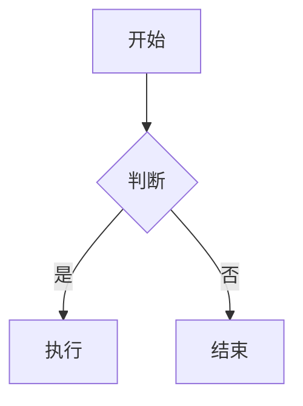

<p align="center">
  
  
  
  
  
</p>

<h1 align="center">🍁 枫语 / Feng Yu</h1>

<p align="center">
  <strong>AI · 强化学习 · 因果推断 · 大语言模型</strong>
</p>

<p align="center">
  一个专注于前沿人工智能研究的技术博客 —— 分享算法研究、工程实践与学术思考。
</p>

---

## ✨ 特性

<table>
  <tr>
    <td width="50%">
      <h4>📝 内容创作</h4>
      <ul>
        <li>Markdown / MDX 混合写作</li>
        <li>KaTeX 数学公式渲染（支持 mhchem 化学扩展）</li>
        <li>Mermaid & PlantUML 图表</li>
        <li>Expressive Code 代码高亮（行号 / 折叠 / 语言徽章）</li>
        <li>GitHub 仓库卡片嵌入</li>
        <li>图片网格布局</li>
        <li>自动阅读时间估算</li>
        <li>文章摘要自动提取</li>
        <li>加密文章（密码保护）</li>
        <li>文章置顶 & 草稿模式</li>
      </ul>
    </td>
    <td width="50%">
      <h4>🎨 视觉体验</h4>
      <ul>
        <li>🌗 亮色 / 暗色 / 跟随系统 三种主题</li>
        <li>🎨 动态主题色（色相任意切换）</li>
        <li>🖼️ 背景壁纸（横幅 / 全屏 / 透明叠加）</li>
        <li>🌸 樱花飘落特效</li>
        <li>🧸 Live2D / Spine 看板娘</li>
        <li>🔤 自定义字体（内置 Google Fonts 字体栈）</li>
        <li>🎴 卡片风格（边框阴影 / 跟随主题色）</li>
      </ul>
    </td>
  </tr>
  <tr>
    <td>
      <h4>🌐 国际化 & 页面</h4>
      <ul>
        <li>🌍 五语言支持：简体中文 / English / 日本語 / Русский / 繁體中文</li>
        <li>📄 首页文章列表 + 无限分页</li>
        <li>🗂️ 归档 / 分类 / 标签 浏览</li>
        <li>🔍 全站 Pagefind 静态搜索</li>
        <li>📡 RSS 订阅</li>
        <li>🖼️ OG 图片自动生成（Satori）</li>
        <li> 留言板</li>
        <li>💰 打赏页面</li>
      </ul>
    </td>
    <td>
      <h4>🔧 交互 & 集成</h4>
      <ul>
        <li>🔄 SPA 式页面过渡动画（Swup.js）</li>
        <li>💬 Giscus 评论系统（GitHub Discussions 驱动）</li>
        <li>🎵 Meting 音乐播放器（网易云 / QQ 音乐等）</li>
        <li>📊 多平台统计分析（GA / Clarity / Umami / 51la）</li>
        <li>📢 顶部公告栏</li>
        <li>🔗 外部链接自动处理（nofollow / 新窗口）</li>
        <li>📧 邮箱地址混淆保护</li>
        <li>⚙️ 用户偏好面板（主题 / 壁纸 / 特效等）</li>
      </ul>
    </td>
  </tr>
</table>

---

## 🛠️ 技术栈

| 层级 | 技术 | 说明 |
|------|------|------|
| 🏗️ 框架 | [Astro 7](https://astro.build) | 静态站点生成，岛屿架构 |
| ⚡ 交互 | [Svelte 5](https://svelte.dev) | 响应式 UI 组件（runes 模式） |
| 🎨 样式 | [Tailwind CSS 4](https://tailwindcss.com) | 原子化 CSS + 自定义主题属性 |
| 📝 格式化 | [Biome](https://biomejs.dev) | Tab 缩进，双引号 |
| 📦 包管理 | pnpm 9 | 强制使用（preinstall 脚本） |
| 🔍 搜索 | [Pagefind](https://pagefind.app) | 构建时静态索引 |
| 💬 评论 | [Giscus](https://giscus.app) | GitHub Discussions 驱动 |
| 📐 数学 | [KaTeX](https://katex.org) | LaTeX 渲染 |
| 📊 图表 | Mermaid + PlantUML | 文本驱动图表 |
| 🔄 过渡 | [Swup.js](https://swup.js.org) | SPA 式页面动画 |
| 🎵 音乐 | [MetingJS](https://github.com/metowolf/MetingJS) | 多平台音乐 API |
| 🖼️ OG | [Satori](https://github.com/vercel/satori) | 服务端 OG 图片生成 |
| 🌐 部署 | GitHub Pages / Vercel / Cloudflare Workers | 多平台适配 |

---

## 🚀 快速开始

```bash
# 克隆仓库
git clone https://github.com/meiluosi/meiluosi.github.io.git
cd meiluosi.github.io

# 安装依赖（强制使用 pnpm）
pnpm install

# 启动开发服务器
pnpm dev
# 访问 http://localhost:4321

# 类型检查 & 构建检查
pnpm type-check
pnpm check

# 构建生产版本
pnpm build

# 本地预览生产构建
pnpm preview
```

---

## 📁 项目结构

```
meiluosi.github.io/
├── src/
│   ├── pages/              # 📄 页面路由（Astro 文件路由）
│   │   ├── index.astro     # 首页（文章列表 + 分页）
│   │   ├── posts/          # 文章详情页
│   │   ├── archive.astro   # 归档页
│   │   ├── about.astro     # 关于页
│   │   ├── guestbook.astro # 留言板
│   │   ├── sponsor.astro   # 打赏页
│   │   ├── search.astro    # 搜索页
│   │   ├── categories/     # 分类页
│   │
│   ├── components/         # 🧩 组件库
│   │   ├── analytics/      # 统计分析组件
│   │   ├── comment/        # 评论组件（Giscus）
│   │   ├── common/         # 通用组件
│   │   ├── controls/       # 交互控件（主题切换等）
│   │   ├── features/       # 功能组件（看板娘、特效等）
│   │   ├── layout/         # 布局组件
│   │   ├── misc/           # 杂项组件
│   │   ├── pages/          # 页面级组件
│   │   └── widget/         # 侧边栏小部件
│   │
│   ├── config/             # ⚙️ 配置文件（TypeScript，类型安全）
│   │   ├── siteConfig.ts   # 站点核心配置
│   │   ├── navBarConfig.ts # 导航栏配置
│   │   ├── sidebarConfig.ts # 侧边栏配置
│   │   ├── pioConfig.ts    # 看板娘配置
│   │   ├── musicConfig.ts  # 音乐播放器配置
│   │   ├── commentConfig.ts # 评论系统配置
│   │   └── ...             # 20+ 可配置模块
│   │
│   ├── i18n/               # 🌍 国际化
│   │   ├── i18nKey.ts      # 翻译键枚举
│   │   ├── translation.ts  # 翻译查找函数
│   │   └── languages/      # 语言文件（zh_CN / en / ja / ru / zh_TW）
│   │
│   ├── content/            # 📝 内容集合
│   │   ├── posts/          # 博客文章（.md / .mdx）
│   │   └── spec/           # 特殊页面内容
│   │
│   ├── plugins/            # 🔌 自定义 remark/rehype 插件
│   ├── utils/              # 🛠️ 工具函数
│   ├── types/              # 📐 TypeScript 类型定义
│   ├── styles/             # 🎨 全局样式
│   └── assets/             # 🖼️ 源资源（图片等）
│
├── public/                 # 📦 静态资源（直接复制到 dist）
│   ├── assets/images/      # 壁纸、赞助图等
│   ├── assets/fonts/       # 字体文件
│   ├── favicon/            # 网站图标
│   └── pio/                # 看板娘模型
│
├── scripts/                # 🔧 构建脚本
│   ├── generate-icons.js   # 图标生成
│   ├── generate-lqips.ts   # 低质量图片占位符
│   ├── subset-fonts.ts     # 字体子集化
│   └── new-post.js         # 新文章脚手架
│
└── docs/                   # 📚 项目文档
    ├── architecture.md     # 架构说明
    ├── features.md         # 功能规划
    ├── roadmap.md          # 开发路线图
    └── integration-ideas.md # 集成方案调研
```

---

## ⚙️ 配置指南

整个站点通过 `src/config/` 下的 TypeScript 文件进行配置，所有配置均带有完整的类型定义，享受 IDE 智能提示。

### 核心配置

| 配置文件 | 用途 |
|----------|------|
| `siteConfig.ts` | 站点标题、描述、主题色、页面宽度、favicon 等 |
| `navBarConfig.ts` | 导航栏链接、子菜单、搜索配置 |
| `sidebarConfig.ts` | 侧边栏布局、组件排列、显示策略 |
| `profileConfig.ts` | 个人资料（头像、昵称、简介、社交链接） |

### 功能配置

| 配置文件 | 用途 |
|----------|------|
| `commentConfig.ts` | 评论系统（Giscus / Twikoo / Waline / Disqus / Artalk） |
| `musicConfig.ts` | 音乐播放器（Meting API / 本地音乐） |
| `pioConfig.ts` | Live2D / Spine 看板娘 |
| `backgroundWallpaper.ts` | 背景壁纸（横幅 / 全屏 / 视频背景） |
| `effectsConfig.ts` | 樱花飘落特效 |
| `analyticsConfig.ts` | 统计分析（GA / Clarity / Umami / 51la） |
| `fontConfig.ts` | 自定义字体（内置 Google Fonts 字体栈） |
| `announcementConfig.ts` | 顶部公告栏 |
| `sponsorConfig.ts` | 打赏方式配置 |
| `licenseConfig.ts` | 文章许可证声明 |

### 示例：修改站点主题色

编辑 `src/config/siteConfig.ts`：

```ts
export const siteConfig: SiteConfig = {
  themeColor: {
    hue: 165,        // 色相 0-360（红=0，绿=120，蓝=240）
    fixed: false,    // 是否禁止用户切换
    defaultMode: "system", // light / dark / system
  },
};
```

### 示例：添加导航栏链接

编辑 `src/config/navBarConfig.ts`，在 `getDynamicNavBarConfig` 函数中添加：

```ts
links.push({
  name: "我的项目",
  url: "https://github.com/meiluosi",
  external: true,
  icon: "fa7-brands:github",
});
```

---

## 📝 内容管理

### 创建新文章

```bash
pnpm new-post my-article-slug
```

这将在 `src/content/posts/` 下生成带有完整 frontmatter 模板的 Markdown 文件。

### 文章 Frontmatter

```yaml
---
title: 文章标题
published: 2026-07-08          # 发布日期
updated: 2026-07-08            # 更新日期（可选）
tags: [强化学习, AlphaZero]    # 标签
category: 技术研究              # 分类
draft: false                   # 是否为草稿
pinned: false                  # 是否置顶
password: ""                   # 加密密码（留空为公开）
comment: true                  # 是否开启评论
description: ""                # 自定义描述（可选）
---
```

### 特殊语法

````md
<!-- KaTeX 数学公式 -->
$$\int_{-\infty}^{\infty} e^{-x^2} dx = \sqrt{\pi}$$

<!-- Mermaid 图表 -->


<!-- GitHub 仓库卡片 -->
:github[https://github.com/meiluosi/meiluosi.github.io]

<!-- 图片网格 -->
:::grid


:::
````

---

## 🏗️ 构建流程


构建命令 `pnpm build` 依次执行：

1. **`scripts/generate-icons.js`** — 生成 SVG 图标常量
2. **`scripts/generate-lqips.ts`** — 为图片生成低质量占位符（LQIP）
3. **`astro build`** — Astro 静态站点构建
4. **`scripts/subset-fonts.ts`** — 字体子集化，减小字体体积
5. **`pagefind --site dist`** — 生成全站搜索索引

---

## 🚢 部署

项目支持多种部署平台，开箱即用：

| 平台 | 配置文件 | 说明 |
|------|----------|------|
| **GitHub Pages** | — | 默认静态输出，`dist/` 目录部署 |
| **Vercel** | `vercel.json` | 零配置部署 |
| **Cloudflare Workers** | `wrangler.jsonc` | 设置 `CF_WORKERS=true` 启用 SSR 适配器 |

```bash
# 构建静态站点
pnpm build
# 部署 dist/ 目录到任意静态托管平台

# 或使用 Vercel CLI
vercel --prod
```

---

## 📖 更多文档

| 文档 | 说明 |
|------|------|
| [架构说明](docs/architecture.md) | 技术栈、目录结构、构建管线、集成模式 |
| [功能规划](docs/features.md) | 按优先级排列的功能创意清单 |
| [开发路线图](docs/roadmap.md) | 分阶段实施计划 |
| [集成方案](docs/integration-ideas.md) | 开源项目调研与集成方案 |
| [AI 编码指南](AGENTS.md) | AI 辅助开发规范 |
| [Claude Code 指南](CLAUDE.md) | Claude Code 使用说明 |

---

## 📄 许可

博客内容采用 [CC BY-NC-SA 4.0](https://creativecommons.org/licenses/by-nc-sa/4.0/) 许可。

代码部分采用 [MIT](LICENSE) 许可。

---

<p align="center">
  <sub>Built with ❤️ using Astro + Svelte + Tailwind CSS</sub>
</p>
