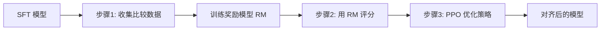

> 训练一个大语言模型，就像培养一位博学多才的学者：首先需要"博览群书"（预训练），然后"术业有专攻"（监督微调），最后还要"知道什么是好的回答"（人类反馈对齐）。
>
> 从 GPT-3 到 ChatGPT，从 LLaMA 到 Claude，现代 LLM 的训练已经形成了一套成熟的**三阶段范式**：预训练（Pre-training）→ 监督微调（SFT）→ 人类反馈强化学习（RLHF）。
>
> 本文将深入剖析 LLM 训练的完整流程，从数据准备到模型对齐，揭示那些让模型"既聪明又听话"的关键技术。

---

## 一、预训练：让模型"读万卷书"

### 1.1 预训练目标

**核心任务**：下一个 Token 预测（Next Token Prediction）

$$
\mathcal{L}_{\text{pretrain}} = -\sum_{t=1}^{T} \log P(x_t | x_{<t}; \theta)
$$

**为什么有效？**
- 迫使模型理解语法、语义、常识、推理
- 无需标注数据，可以利用海量文本
- 涌现能力：规模足够大时，出现意外的智能行为

### 1.2 预训练数据准备

**数据来源**（以 LLaMA 为例）：

| 数据源 | 占比 | 特点 | Token 数量 |
|--------|------|------|-----------|
| **Common Crawl** | 67% | 网页数据，需大量清洗 | 1.0T |
| **C4** | 15% | Common Crawl 清洗版 | 220B |
| **GitHub** | 4.5% | 代码数据 | 65B |
| **Wikipedia** | 4.5% | 高质量百科知识 | 65B |
| **Books** | 4.5% | 书籍长文本 | 65B |
| **ArXiv** | 2.5% | 科学论文 | 36B |
| **StackExchange** | 2% | 技术问答 | 29B |

**数据清洗流程**：

```python
import re
from bs4 import BeautifulSoup
from langdetect import detect

class DataCleaner:
    def __init__(self):
        self.min_length = 100  # 最小字符数
        self.max_length = 100000  # 最大字符数
        
    def clean(self, text):
        """数据清洗管道"""
        # 1. 移除 HTML 标签
        text = self._remove_html(text)
        
        # 2. 语言检测（保留目标语言）
        if not self._is_valid_language(text):
            return None
        
        # 3. 去重（URL级别 + 内容级别）
        if self._is_duplicate(text):
            return None
        
        # 4. 质量过滤
        if not self._quality_filter(text):
            return None
        
        # 5. 移除个人信息（PII）
        text = self._remove_pii(text)
        
        # 6. 标准化
        text = self._normalize(text)
        
        return text
    
    def _remove_html(self, text):
        """移除 HTML 标签"""
        soup = BeautifulSoup(text, 'html.parser')
        return soup.get_text()
    
    def _is_valid_language(self, text, target_lang='en'):
        """语言检测"""
        try:
            lang = detect(text[:1000])  # 只检测前 1000 字符
            return lang == target_lang
        except:
            return False
    
    def _quality_filter(self, text):
        """质量过滤"""
        # 长度检查
        if len(text) < self.min_length or len(text) > self.max_length:
            return False
        
        # 字母/数字比例（过滤乱码）
        alnum_ratio = sum(c.isalnum() for c in text) / len(text)
        if alnum_ratio < 0.5:
            return False
        
        # 重复行检查（过滤模板内容）
        lines = text.split('\n')
        unique_lines = len(set(lines))
        if unique_lines / len(lines) < 0.3:
            return False
        
        # 停用词密度（过滤低质量内容）
        stopwords = {'the', 'a', 'an', 'is', 'are', 'was', 'were'}
        words = text.lower().split()
        stopword_ratio = sum(w in stopwords for w in words) / len(words)
        if stopword_ratio < 0.05:  # 正常文本应有一定停用词
            return False
        
        return True
    
    def _remove_pii(self, text):
        """移除个人信息"""
        # 邮箱
        text = re.sub(r'\b[A-Za-z0-9._%+-]+@[A-Za-z0-9.-]+\.[A-Z|a-z]{2,}\b', '[EMAIL]', text)
        
        # 电话号码
        text = re.sub(r'\b\d{3}[-.]?\d{3}[-.]?\d{4}\b', '[PHONE]', text)
        
        # IP 地址
        text = re.sub(r'\b\d{1,3}\.\d{1,3}\.\d{1,3}\.\d{1,3}\b', '[IP]', text)
        
        return text
    
    def _normalize(self, text):
        """文本标准化"""
        # 统一空白字符
        text = re.sub(r'\s+', ' ', text)
        
        # 移除控制字符
        text = ''.join(char for char in text if ord(char) >= 32 or char == '\n')
        
        return text.strip()

# 使用
cleaner = DataCleaner()
cleaned_text = cleaner.clean(raw_text)
```

**去重策略**：

```python
from datasketch import MinHash, MinHashLSH

class Deduplicator:
    def __init__(self, threshold=0.8):
        self.lsh = MinHashLSH(threshold=threshold, num_perm=128)
        self.seen = set()
        
    def is_duplicate(self, text, doc_id):
        """使用 MinHash LSH 检测近似重复"""
        # 创建 MinHash 签名
        minhash = MinHash(num_perm=128)
        for word in text.split():
            minhash.update(word.encode('utf8'))
        
        # 查询相似文档
        result = self.lsh.query(minhash)
        
        if result:
            return True  # 发现重复
        
        # 添加到索引
        self.lsh.insert(doc_id, minhash)
        return False

# 使用
dedup = Deduplicator(threshold=0.8)
for doc_id, text in enumerate(documents):
    if not dedup.is_duplicate(text, doc_id):
        # 保留非重复文档
        cleaned_docs.append(text)
```

### 1.3 Tokenization

**字节对编码（BPE）**：

```python
from tokenizers import Tokenizer
from tokenizers.models import BPE
from tokenizers.trainers import BpeTrainer
from tokenizers.pre_tokenizers import Whitespace

# 训练 BPE tokenizer
tokenizer = Tokenizer(BPE(unk_token="<unk>"))
tokenizer.pre_tokenizer = Whitespace()

trainer = BpeTrainer(
    vocab_size=50000,
    special_tokens=["<pad>", "<s>", "</s>", "<unk>", "<mask>"]
)

# 在数据上训练
tokenizer.train(files=["train.txt"], trainer=trainer)

# 保存
tokenizer.save("tokenizer.json")

# 使用
encoded = tokenizer.encode("Hello, world!")
print(f"Tokens: {encoded.tokens}")
print(f"IDs: {encoded.ids}")
```

**SentencePiece（适合多语言）**：

```python
import sentencepiece as spm

# 训练
spm.SentencePieceTrainer.train(
    input='train.txt',
    model_prefix='spm_model',
    vocab_size=32000,
    character_coverage=0.9995,  # 覆盖 99.95% 字符
    model_type='bpe',
    pad_id=0,
    unk_id=1,
    bos_id=2,
    eos_id=3
)

# 加载
sp = spm.SentencePieceProcessor()
sp.load('spm_model.model')

# 编码
tokens = sp.encode_as_pieces("你好，世界！")
ids = sp.encode_as_ids("你好，世界！")
```

### 1.4 预训练流程

```python
import torch
import torch.nn as nn
from transformers import GPT2Config, GPT2LMHeadModel
from torch.utils.data import DataLoader
from datasets import load_dataset

# 1. 配置模型
config = GPT2Config(
    vocab_size=50257,
    n_positions=2048,
    n_embd=768,
    n_layer=12,
    n_head=12
)

model = GPT2LMHeadModel(config)
model = model.cuda()

# 2. 准备数据
dataset = load_dataset("openwebtext", split="train")

def tokenize_function(examples):
    return tokenizer(
        examples["text"],
        truncation=True,
        max_length=2048,
        padding="max_length"
    )

tokenized_dataset = dataset.map(tokenize_function, batched=True)
dataloader = DataLoader(tokenized_dataset, batch_size=8, shuffle=True)

# 3. 优化器（使用 AdamW + 学习率调度）
optimizer = torch.optim.AdamW(
    model.parameters(),
    lr=6e-4,
    betas=(0.9, 0.95),
    weight_decay=0.1
)

from transformers import get_cosine_schedule_with_warmup
scheduler = get_cosine_schedule_with_warmup(
    optimizer,
    num_warmup_steps=2000,
    num_training_steps=100000
)

# 4. 训练循环
model.train()
for epoch in range(num_epochs):
    for batch in dataloader:
        input_ids = batch['input_ids'].cuda()
        attention_mask = batch['attention_mask'].cuda()
        
        # 前向传播
        outputs = model(
            input_ids=input_ids,
            attention_mask=attention_mask,
            labels=input_ids  # 自回归：输入即标签
        )
        
        loss = outputs.loss
        
        # 反向传播
        loss.backward()
        
        # 梯度裁剪（防止梯度爆炸）
        torch.nn.utils.clip_grad_norm_(model.parameters(), max_norm=1.0)
        
        optimizer.step()
        scheduler.step()
        optimizer.zero_grad()
        
        if step % 100 == 0:
            print(f"Step {step}, Loss: {loss.item():.4f}")
```

**分布式训练（使用 DeepSpeed）**：

```python
import deepspeed

# DeepSpeed 配置
ds_config = {
    "train_batch_size": 64,
    "gradient_accumulation_steps": 8,
    "fp16": {
        "enabled": True
    },
    "zero_optimization": {
        "stage": 2,  # ZeRO-2: 分片优化器状态
        "offload_optimizer": {
            "device": "cpu"
        }
    }
}

# 初始化 DeepSpeed
model_engine, optimizer, _, _ = deepspeed.initialize(
    model=model,
    model_parameters=model.parameters(),
    config=ds_config
)

# 训练
for batch in dataloader:
    loss = model_engine(batch)
    model_engine.backward(loss)
    model_engine.step()
```

---

## 二、监督微调（SFT）：让模型"术业有专攻"

### 2.1 SFT 数据构造

**指令-回答对格式**：

```json
{
  "instruction": "解释什么是量子纠缠",
  "input": "",
  "output": "量子纠缠是量子力学中的一种现象，指两个或多个粒子之间存在一种特殊的关联..."
}

{
  "instruction": "将以下句子翻译成英文",
  "input": "今天天气很好。",
  "output": "The weather is very nice today."
}
```

**Prompt 模板**：

```python
def format_instruction(example):
    """将数据格式化为训练格式"""
    if example.get("input"):
        prompt = f"""Below is an instruction that describes a task, paired with an input that provides further context. Write a response that appropriately completes the request.

### Instruction:
{example['instruction']}

### Input:
{example['input']}

### Response:
{example['output']}"""
    else:
        prompt = f"""Below is an instruction that describes a task. Write a response that appropriately completes the request.

### Instruction:
{example['instruction']}

### Response:
{example['output']}"""
    
    return {"text": prompt}

# 应用到数据集
sft_dataset = dataset.map(format_instruction)
```

### 2.2 SFT 训练

```python
from transformers import Trainer, TrainingArguments

# 加载预训练模型
model = GPT2LMHeadModel.from_pretrained("gpt2-medium")

# 训练配置
training_args = TrainingArguments(
    output_dir="./sft_model",
    num_train_epochs=3,
    per_device_train_batch_size=4,
    gradient_accumulation_steps=4,
    learning_rate=2e-5,  # SFT 学习率比预训练小
    warmup_steps=100,
    logging_steps=10,
    save_steps=500,
    evaluation_strategy="steps",
    eval_steps=500,
    fp16=True
)

# 数据整理器（处理 padding）
from transformers import DataCollatorForLanguageModeling
data_collator = DataCollatorForLanguageModeling(
    tokenizer=tokenizer,
    mlm=False  # 因果语言模型，不使用 MLM
)

# 训练
trainer = Trainer(
    model=model,
    args=training_args,
    train_dataset=train_dataset,
    eval_dataset=eval_dataset,
    data_collator=data_collator
)

trainer.train()
```

### 2.3 高质量 SFT 数据的关键

**Self-Instruct**：让模型自己生成训练数据

```python
def self_instruct(seed_instructions, model, num_generate=1000):
    """使用模型生成新的指令-回答对"""
    generated_data = []
    
    for _ in range(num_generate):
        # 随机选择种子指令作为示例
        examples = random.sample(seed_instructions, k=3)
        
        prompt = f"""Generate a new instruction-input-output example.

Examples:
{format_examples(examples)}

New example:
Instruction:"""
        
        # 生成新指令
        new_instruction = model.generate(prompt, max_tokens=100)
        
        # 生成对应的输出
        output_prompt = f"Instruction: {new_instruction}\nResponse:"
        new_output = model.generate(output_prompt, max_tokens=200)
        
        generated_data.append({
            "instruction": new_instruction,
            "output": new_output
        })
    
    return generated_data
```

**Evol-Instruct**：进化式指令增强

```python
evolve_prompts = [
    "Add more constraints to make the instruction more specific",
    "Deepen the instruction by adding reasoning requirements",
    "Complicate the instruction by introducing multiple steps",
    "Increase the breadth by asking about related concepts"
]

def evolve_instruction(instruction, model):
    """进化指令，增加难度"""
    evolve_type = random.choice(evolve_prompts)
    
    prompt = f"""Original instruction: {instruction}

{evolve_type}

Evolved instruction:"""
    
    evolved = model.generate(prompt, max_tokens=150)
    return evolved
```

---

## 三、人类反馈强化学习（RLHF）：让模型"知道什么是好"

### 3.1 RLHF 三步走



### 3.2 步骤1：收集人类偏好数据

**数据格式**：

```json
{
  "prompt": "解释相对论",
  "chosen": "爱因斯坦的相对论包括狭义相对论和广义相对论...",
  "rejected": "相对论就是说时间是相对的。"
}
```

**收集方式**：
1. 给标注员展示同一 prompt 的多个回答
2. 标注员排序：A > B > C > D
3. 转换为成对比较：(A, B), (A, C), (B, C)...

### 3.3 步骤2：训练奖励模型（Reward Model）

```python
import torch
import torch.nn as nn

class RewardModel(nn.Module):
    def __init__(self, base_model):
        super().__init__()
        self.base_model = base_model
        
        # 添加奖励头（输出标量分数）
        hidden_size = base_model.config.hidden_size
        self.reward_head = nn.Linear(hidden_size, 1)
        
    def forward(self, input_ids, attention_mask):
        # 获取最后一个 token 的隐藏状态
        outputs = self.base_model(
            input_ids=input_ids,
            attention_mask=attention_mask,
            output_hidden_states=True
        )
        
        last_hidden_state = outputs.hidden_states[-1]
        
        # 提取最后一个非 padding token 的状态
        sequence_lengths = attention_mask.sum(dim=1) - 1
        batch_size = input_ids.shape[0]
        
        last_token_hidden = last_hidden_state[
            torch.arange(batch_size, device=input_ids.device),
            sequence_lengths
        ]
        
        # 计算奖励分数
        reward = self.reward_head(last_token_hidden)
        return reward

# 训练奖励模型
def train_reward_model(model, dataloader, epochs=1):
    optimizer = torch.optim.Adam(model.parameters(), lr=1e-5)
    
    model.train()
    for epoch in range(epochs):
        for batch in dataloader:
            # batch 包含 chosen 和 rejected 两个版本
            chosen_ids = batch['chosen_input_ids'].cuda()
            chosen_mask = batch['chosen_attention_mask'].cuda()
            rejected_ids = batch['rejected_input_ids'].cuda()
            rejected_mask = batch['rejected_attention_mask'].cuda()
            
            # 计算奖励
            reward_chosen = model(chosen_ids, chosen_mask)
            reward_rejected = model(rejected_ids, rejected_mask)
            
            # Bradley-Terry 模型损失
            loss = -torch.log(torch.sigmoid(reward_chosen - reward_rejected)).mean()
            
            # 反向传播
            optimizer.zero_grad()
            loss.backward()
            optimizer.step()
            
            if step % 100 == 0:
                print(f"Loss: {loss.item():.4f}")
```

### 3.4 步骤3：PPO 强化学习优化

**PPO（Proximal Policy Optimization）算法**：

```python
from trl import PPOTrainer, PPOConfig, AutoModelForCausalLMWithValueHead
from transformers import AutoTokenizer

# 配置
ppo_config = PPOConfig(
    model_name="sft_model",
    learning_rate=1.41e-5,
    batch_size=64,
    mini_batch_size=8,
    gradient_accumulation_steps=8,
    ppo_epochs=4,
    max_grad_norm=0.5
)

# 加载模型
model = AutoModelForCausalLMWithValueHead.from_pretrained("sft_model")
ref_model = AutoModelForCausalLMWithValueHead.from_pretrained("sft_model")  # 参考模型
tokenizer = AutoTokenizer.from_pretrained("sft_model")

# 加载奖励模型
reward_model = RewardModel.from_pretrained("reward_model").cuda()
reward_model.eval()

# PPO 训练器
ppo_trainer = PPOTrainer(
    config=ppo_config,
    model=model,
    ref_model=ref_model,
    tokenizer=tokenizer
)

# 训练循环
for epoch in range(num_epochs):
    for batch in dataloader:
        prompts = batch['prompt']
        
        # 生成回答
        query_tensors = [tokenizer.encode(p, return_tensors="pt")[0] for p in prompts]
        response_tensors = ppo_trainer.generate(query_tensors, **generation_kwargs)
        
        # 计算奖励
        texts = [tokenizer.decode(r) for r in response_tensors]
        rewards = []
        for text in texts:
            input_ids = tokenizer.encode(text, return_tensors="pt").cuda()
            with torch.no_grad():
                reward = reward_model(input_ids, attention_mask=torch.ones_like(input_ids))
            rewards.append(reward.cpu())
        
        # PPO 更新
        stats = ppo_trainer.step(query_tensors, response_tensors, rewards)
        
        if step % 100 == 0:
            print(f"Mean reward: {stats['ppo/mean_scores']:.4f}")
```

**KL 散度惩罚**（防止模型偏离太远）：

$$
\mathcal{L}_{\text{PPO}} = \mathbb{E}[\min(r_t(\theta) \hat{A}_t, \text{clip}(r_t(\theta), 1-\epsilon, 1+\epsilon) \hat{A}_t)] - \beta \cdot \text{KL}(\pi_\theta || \pi_{\text{ref}})
$$

### 3.5 DPO：更简单的对齐方法

**直接偏好优化（Direct Preference Optimization）**：

```python
from trl import DPOTrainer, DPOConfig

dpo_config = DPOConfig(
    beta=0.1,  # KL 惩罚系数
    learning_rate=5e-7,
    num_train_epochs=1,
    per_device_train_batch_size=4,
    gradient_accumulation_steps=4
)

dpo_trainer = DPOTrainer(
    model=model,
    ref_model=ref_model,
    args=dpo_config,
    train_dataset=preference_dataset,  # 包含 chosen 和 rejected
    tokenizer=tokenizer
)

dpo_trainer.train()
```

**DPO 损失**：

$$
\mathcal{L}_{\text{DPO}} = -\mathbb{E}_{(x, y_w, y_l) \sim \mathcal{D}} \left[ \log \sigma \left( \beta \log \frac{\pi_\theta(y_w|x)}{\pi_{\text{ref}}(y_w|x)} - \beta \log \frac{\pi_\theta(y_l|x)}{\pi_{\text{ref}}(y_l|x)} \right) \right]
$$

**DPO vs PPO**：

| 特性 | PPO | DPO |
|------|-----|-----|
| **训练稳定性** | ⭐⭐⭐ | ⭐⭐⭐⭐⭐ |
| **计算成本** | 高（需要 4 个模型） | 低（只需 2 个模型） |
| **实现复杂度** | 高 | 低 |
| **性能** | ⭐⭐⭐⭐⭐ | ⭐⭐⭐⭐ |
| **适用场景** | 大规模生产 | 快速实验 |

---

## 四、训练优化技巧

### 4.1 混合精度训练

```python
from torch.cuda.amp import autocast, GradScaler

scaler = GradScaler()

for batch in dataloader:
    optimizer.zero_grad()
    
    # 使用混合精度
    with autocast():
        outputs = model(batch)
        loss = outputs.loss
    
    # 缩放损失并反向传播
    scaler.scale(loss).backward()
    
    # 梯度裁剪
    scaler.unscale_(optimizer)
    torch.nn.utils.clip_grad_norm_(model.parameters(), max_norm=1.0)
    
    # 更新参数
    scaler.step(optimizer)
    scaler.update()
```

### 4.2 梯度检查点（节省显存）

```python
from torch.utils.checkpoint import checkpoint

class CheckpointedTransformerLayer(nn.Module):
    def forward(self, x):
        # 使用 checkpoint 包装前向传播
        return checkpoint(self._forward, x)
    
    def _forward(self, x):
        # 实际的前向计算
        x = self.attention(x)
        x = self.ffn(x)
        return x
```

### 4.3 ZeRO 优化器（分布式训练）

**ZeRO-1**：分片优化器状态
**ZeRO-2**：分片优化器状态 + 梯度
**ZeRO-3**：分片优化器状态 + 梯度 + 模型参数

```json
{
  "zero_optimization": {
    "stage": 3,
    "offload_optimizer": {
      "device": "cpu",
      "pin_memory": true
    },
    "offload_param": {
      "device": "cpu",
      "pin_memory": true
    },
    "overlap_comm": true,
    "contiguous_gradients": true,
    "sub_group_size": 1e9,
    "reduce_bucket_size": 5e8,
    "stage3_prefetch_bucket_size": 5e8,
    "stage3_param_persistence_threshold": 1e6
  }
}
```

---

## 五、评估与监控

### 5.1 训练指标监控

```python
import wandb

wandb.init(project="llm-training")

# 记录指标
wandb.log({
    "loss": loss.item(),
    "perplexity": torch.exp(loss).item(),
    "learning_rate": scheduler.get_last_lr()[0],
    "gradient_norm": grad_norm,
    "tokens_per_second": tokens_per_sec
})
```

### 5.2 模型评估

```python
from lm_eval import evaluator

# 在多个基准上评估
results = evaluator.simple_evaluate(
    model="hf-causal",
    model_args="pretrained=my_model",
    tasks=["hellaswag", "arc_easy", "mmlu", "truthfulqa"],
    num_fewshot=0,
    batch_size=8
)

print(results['results'])
```

---

## 六、完整训练实例

```python
import torch
from transformers import AutoModelForCausalLM, AutoTokenizer
from datasets import load_dataset
from trl import SFTTrainer, DPOTrainer

# ===== 阶段1: 预训练（假设已完成）=====
base_model = "meta-llama/Llama-2-7b-hf"

# ===== 阶段2: SFT =====
sft_dataset = load_dataset("timdettmers/openassistant-guanaco")

model = AutoModelForCausalLM.from_pretrained(base_model)
tokenizer = AutoTokenizer.from_pretrained(base_model)

sft_trainer = SFTTrainer(
    model=model,
    train_dataset=sft_dataset['train'],
    max_seq_length=2048,
    dataset_text_field="text",
    packing=True
)

sft_trainer.train()
sft_model_path = "./sft_model"
sft_trainer.save_model(sft_model_path)

# ===== 阶段3: DPO =====
preference_dataset = load_dataset("Anthropic/hh-rlhf")

model = AutoModelForCausalLM.from_pretrained(sft_model_path)
ref_model = AutoModelForCausalLM.from_pretrained(sft_model_path)

dpo_trainer = DPOTrainer(
    model=model,
    ref_model=ref_model,
    train_dataset=preference_dataset['train'],
    tokenizer=tokenizer,
    beta=0.1
)

dpo_trainer.train()
dpo_trainer.save_model("./aligned_model")

print("训练完成！")
```

---

## 七、总结

**LLM 训练三阶段**：

1. **预训练**：在海量文本上学习语言理解
   - 关键：高质量数据清洗、去重
   - 技巧：分布式训练、混合精度、梯度检查点

2. **监督微调**：在指令数据上学习遵循指令
   - 关键：高质量指令-回答对
   - 技巧：Self-Instruct、Evol-Instruct

3. **RLHF/DPO**：根据人类偏好对齐
   - 关键：高质量比较数据、奖励模型训练
   - 技巧：PPO（经典）或 DPO（简单）

**最佳实践**：
- 使用 DeepSpeed ZeRO 进行大规模训练
- 监控训练曲线，及时发现问题
- 在多个基准上评估，避免过拟合
- 使用 DPO 快速实验，PPO 用于最终优化

---

## 参考资源

**论文**：
- [GPT-3: Language Models are Few-Shot Learners](https://arxiv.org/abs/2005.14165)
- [InstructGPT: Training language models to follow instructions](https://arxiv.org/abs/2203.02155)
- [DPO: Direct Preference Optimization](https://arxiv.org/abs/2305.18290)

**工具**：
- [Hugging Face TRL](https://github.com/huggingface/trl) - RLHF 工具库
- [DeepSpeed](https://github.com/microsoft/DeepSpeed) - 分布式训练
- [Axolotl](https://github.com/OpenAccess-AI-Collective/axolotl) - 完整训练框架

**数据集**：
- [Alpaca](https://github.com/tatsu-lab/stanford_alpaca) - 指令数据
- [Anthropic HH-RLHF](https://huggingface.co/datasets/Anthropic/hh-rlhf) - 偏好数据
- [OpenAssistant](https://huggingface.co/datasets/OpenAssistant/oasst1) - 多轮对话数据
