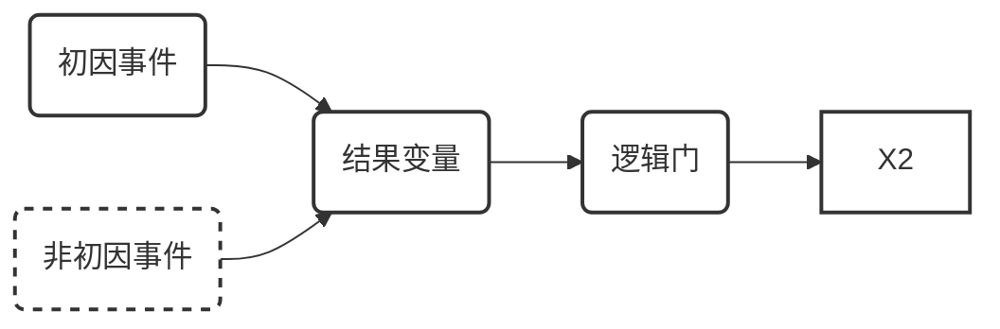

1237
    动态不确定因果图（DUCG）是一种用于知识表示和推理的模型，特别适用于动态系统中的不确定性问题，例如故障诊断。
    DUCG的核心思想是将不确定的因果作用机制用虚拟的独立随机事件来表达，并通过量化随机事件发生的概率和因果关系存在的概率来处理不确定性。
    DUCG模型由基本变量X、结果变量B、逻辑门G和因果作用事件F组成，通过有向弧连接，表示变量之间的因果关系。
    与传统的因果图模型相比，DUCG具有以下优势：
    （1）处理不确定性：DUCG可以有效地处理知识不完备、观测数据缺失、信号虚假等问题。
    （2）处理动态系统：DUCG可以建模和分析变量在时间序列上的状态动态演化过程。
    （3）处理静态逻辑循环：DUCG可以处理静态因果图中的逻辑循环问题。
    （4）高效推理：DUCG采用权重逻辑推理，可以高效地进行推理计算。
    目前，DUCG已在核电、化工、航天系统故障诊断和可靠性分析、智慧医疗等领域得到广泛应用。
    下面我们将从DUCG的不确定性因果表达机制、动态诊断推理算法、Cubic-DUCG立体因果建模与动态推理算法四方面介绍DUCG模型相关理论。

   # 1. 不确定因果表达机制
DUCG 的核心思想是将不确定的因果作用机制用虚拟的独立随机事件来表达，并通过量化随机事件发生的概率和因果关系存在的概率来处理不确定性。

**DUCG 模型包含以下元素**：

- **基本变量 (B)**: 代表系统中的根原因事件，分为初因事件（可直接引发系统异常）和非初因事件（需受初因事件触发才起作用）。
- **结果变量 (X)**: 代表系统中的观测变量，通常可以观测到其状态。
- **缺省原因事件 (D)**: 代表结果变量的缺省原因，即当没有其他原因导致异常时，结果变量异常的原因。P2
- **逻辑门 (G)**: 代表变量之间的组合逻辑关系，例如与门、或门等。
- **因果作用事件 (F)**: 代表变量之间的因果作用，用有向弧连接，并标注权重表示因果关系的强度。

**不确定性因果表达机制**：

- **虚拟事件**：DUCG 将不确定的因果作用机制用虚拟的独立随机事件来表达。例如，一个变量 X 的异常状态可能由多个不同的原因导致，每个原因对应一个虚拟事件。
- **概率量化**：DUCG 量化不确定性，包括随机事件发生的概率和因果关系存在的概率。例如，一个虚拟事件发生的概率表示该原因导致结果变量异常的可能性，而因果关系存在的概率表示该原因与结果变量之间存在因果关系的可能性。

   #  2. 动态诊断推理算法

DUCG 动态诊断推理算法能够有效地处理动态系统中的不确定性问题，并准确地进行故障诊断。其基本思想是将动态推理问题分解为一系列静态时间片上的推理，并通过整合各时间片的推理结果来得到最终的诊断结论。

**算法步骤**：

1. **时间片划分**： 将故障诊断过程划分为一系列时间片，每个时间片对应一段时间内的观测数据和因果图。
2. **因果图构建**： 在每个时间片内，根据观测数据和预先建立的因果图模型，构建该时间片内的因果图。
3. **因果图化简**： 对每个时间片内的因果图进行化简，去除与推理无关的节点和边，降低模型的复杂度。
4. **假设空间计算**： 在每个时间片内，根据化简后的因果图和观测数据，计算假设空间，即所有可能的故障原因集合。
5. **状态概率计算**： 在每个时间片内，计算每个假设事件在观测数据条件下的状态概率。
6. **时间片推理整合**： 将各时间片的推理结果进行整合，得到每个假设事件在整个故障诊断过程中的状态概率。
7. **故障诊断**： 根据假设事件的排序概率，确定最可能的故障原因。

## 时间片划分

## 因果图构建

## 因果图化简

## 假设空间计算

## 状态概率计算

## 时间片推理整合

## 故障诊断

   #  3. Cubic-DUCG立体因果建模与动态推理

