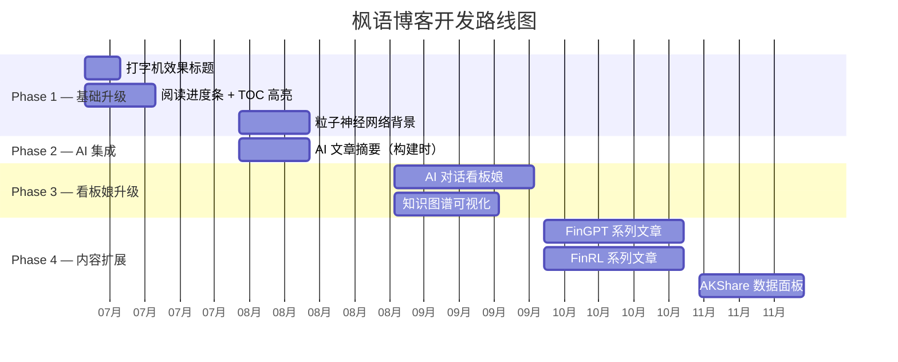

# 🗺️ 开发路线图

> 分阶段实施计划，基于 [features.md](./features.md) 和 [integration-ideas.md](./integration-ideas.md)。

---

## 路线图总览

---

## Phase 1：基础体验升级 🏠

> 目标：提升博客整体体验，不涉及外部 API，纯前端改造。

| 序号 | 功能 | 预估工时 | 依赖 | 状态 |
|------|------|---------|------|------|
| 1.1 | 打字机效果标题 | 1 天 | 已有 `TypewriterText.astro` | ✅ 已完成 |
| 1.2 | 阅读进度条 + TOC 高亮 | 2 天 | Svelte 组件 | ⏳ 待开始 |
| 1.3 | 粒子神经网络背景 | 3 天 | Canvas API | ⏳ 待开始 |
| 1.4 | 暗色/亮色代码主题切换 | 1 天 | Expressive Code 配置 | ✅ 已完成 |

**交付物**：
- 更酷的首页视觉效果
- 更好的阅读体验
- 代码块在亮/暗模式下都有良好显示

---

## Phase 2：AI 能力集成 🤖

> 目标：引入 AI 能力，零风险方案为主。

| 序号 | 功能 | 预估工时 | 依赖 | 状态 |
|------|------|---------|------|------|
| 2.1 | AI 文章摘要（构建时） | 3 天 | LLM API Key（CI 环境变量） | ✅ 已完成 |
| 2.2 | 文章底部 Mermaid 思维导图 | 2 天 | 构建时脚本 | ⏳ 待开始 |

**交付物**：
- 文章页顶部 AI 摘要卡片
- 文章页底部自动生成的思维导图

**Phase 2.1 详细步骤（AI 摘要）**：
1. 编写 `scripts/generate-summaries.ts`
2. 在 `astro.config.mjs` 中注册构建钩子
3. 设计摘要 UI 组件（Svelte）
4. 在文章页顶部渲染摘要卡片

---

## Phase 3：看板娘升级 + 知识图谱 🎭

> 目标：激活看板娘 + 打造独特的知识图谱页面。

| 序号 | 功能 | 预估工时 | 依赖 | 状态 |
|------|------|---------|------|------|
| 3.1 | AI 对话看板娘 | 2 周 | Cloudflare Worker + LLM API | ✅ 已完成 |
| 3.2 | 知识图谱可视化 | 1 周 | ECharts / D3.js | ✅ 已完成 |
| 3.3 | 可选：Anki 风格 Flashcards | 1 周 | 构建时 LLM 生成 | ⏳ 待开始 |

**交付物**：
- 点击看板娘可进行 AI 对话（流式输出）
- `/graph/` 知识图谱页面（或在 `/about/` 内嵌）
- 可选：文章末尾知识点卡片

**Phase 3.1 详细步骤（AI 对话看板娘）**：
1. 创建 Cloudflare Worker 项目
2. 实现 LLM API 代理（含 rate limit）
3. 设计对话 UI 组件（Svelte 5）
4. 对接看板娘点击交互（复用 `pioConfig.ts`）
5. 实现流式输出 + 打字机效果
6. 设计 System Prompt（枫语博客 AI 助手人设）
7. 可选：RAG 索引博客文章

---

## Phase 4：内容生态扩展 📝

> 目标：丰富博客内容，强化 AI/RL/金融 技术定位。

| 序号 | 功能 | 预估工时 | 依赖 | 状态 |
|------|------|---------|------|------|
| 4.1 | FinGPT 系列文章 | 每篇 2-3 天 | 无 | ⏳ 待开始 |
| 4.2 | FinRL 系列文章 | 每篇 2-3 天 | 无 | ⏳ 待开始 |
| 4.3 | AKShare 数据面板 | 1 周 | Python 环境 + ECharts | ⏳ 待开始 |
| 4.4 | 因果推断在线计算器 | 2 周 | D3.js / dagitty | ⏳ 待开始 |

**交付物**：
- 3-5 篇 FinGPT 实战文章
- 3-5 篇 FinRL 实战文章（含 Colab Notebook）
- `/data/` 数据面板页面（静态生成）
- `/causal/` 因果推断互动工具

**Phase 4.3 详细步骤（AKShare 数据面板）**：
1. 编写 `scripts/fetch-finance-data.py`，调用 AKShare 获取数据
2. 生成 JSON 数据文件到 `src/constants/`
3. 创建 Svelte + ECharts 数据面板组件
4. 创建 `/data/` 页面路由
5. 在 `pnpm build` 中集成数据获取步骤

**Phase 4.4 详细步骤（因果推断工具）**：
1. 研究 `dagitty` 的 JS 版本或 WASM 编译
2. 设计因果图画布组件（Svelte + D3.js）
3. 实现节点拖拽、连线、do-operator
4. 创建 `/causal/` 页面路由

---

## 未来探索 🚀

以下功能待评估，根据技术发展和读者反馈决定是否推进：

| 功能 | 优先级 | 说明 |
|------|--------|------|
| 浏览器内 RL 演示 | 低 | 需要 TensorFlow.js / ONNX Runtime Web |
| 文章 AI 朗读（TTS） | 低 | 构建时间显著增加 |
| 数字人看板娘 | 极低 | 需要 GPU 算力，实时性要求高 |
| OpenBB MCP 集成 | 极低 | 需要部署后端服务 |
| 互动式 DUCG 因果图 | 中 | 与博客核心主题高度契合，但实现复杂 |

---

## 版本记录

| 日期 | 版本 | 更新内容 |
|------|------|---------|
| 2025-07 | v0.1 | 初始路线图，制定 Phase 1-4 计划 |
| - | - | 完成项目清理，删除 Jekyll 遗留 + 未使用的 ACG 功能 |