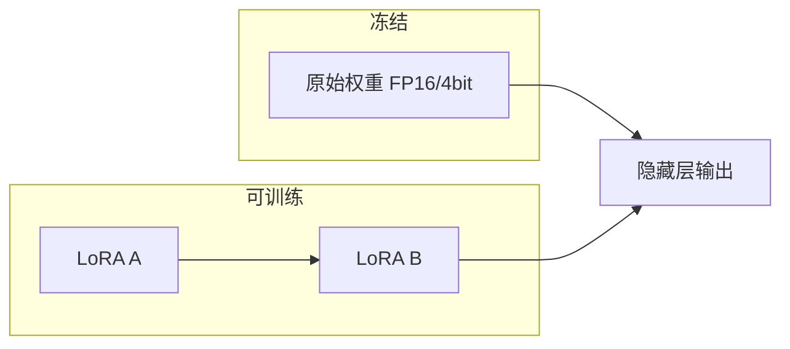
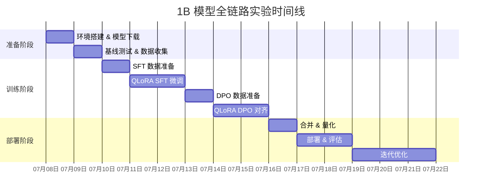

> 不满足于调用 API，想亲手跑通大模型训练的完整链路？不用租 GPU，不用配集群——本文以 MacBook Air M4（16GB 统一内存）为实验平台，制定一份从 SFT 微调到 DPO 对齐、再到本地部署的完整实验计划，让你用一台笔记本就能理解 LLM 训练的每一个环节。

---

## 一、写在前面：为什么选择 1B 模型？

大模型训练有三座大山：**算力、数据、工程**。对于个人学习者来说，最大的瓶颈不是"学不会"，而是"跑不动"。

1B 参数规模的模型恰好踩在一个甜蜜点上：

| 对比维度 | 7B 模型 | 1B 模型 |
|---------|--------|--------|
| QLoRA 微调显存 | 10-14 GB | 5-7 GB |
| 单轮训练时间 | 数小时 | 数十分钟 |
| 推理速度 | 中等 | 极快（>50 tok/s） |
| 学习价值 | 完整链路 | 完整链路 ✅ |
| M4 16GB 可行性 | ⚠️ 勉强 | ✅ 舒适 |

**结论**：1B 模型能让你在 16GB 的 MacBook Air 上跑通所有核心环节，而 7B 模型在这个配置上会频繁 OOM，学习体验大打折扣。

---

## 二、实验平台：M4 芯片的 AI 能力剖析

### 2.1 硬件特性

| 特性 | 规格 | 对大模型实验的意义 |
|------|------|-------------------|
| CPU | 10 核（4P + 6E） | 数据预处理、tokenization |
| GPU | 10 核 | 矩阵运算主力 |
| 统一内存 | 16 GB LPDDR5X | CPU/GPU 共享，无拷贝开销 |
| 内存带宽 | ~120 GB/s | 推理吞吐的关键瓶颈 |
| Neural Engine | 16 核 | 可加速部分推理算子 |
| 存储 | 256 GB SSD | 需外接硬盘存数据集 |

### 2.2 为什么 MLX 是最佳选择？

Apple 官方推出的 **MLX** 框架专为 Apple Silicon 设计，相比 PyTorch MPS 后端有以下优势：

- **统一内存模型**：无需手动管理 CPU/GPU 数据传输
- **惰性计算**：自动融合算子，减少内存占用
- **原生支持 QLoRA**：`mlx-lm` 提供开箱即用的 LoRA/QLoRA 微调
- **共享内存权重**：加载模型时不会产生额外拷贝

> **一句话总结**：在 Mac 上搞大模型，MLX 就是标准答案。不要用 PyTorch + MPS，不要用 llama.cpp 做训练，直接用 MLX。

---

## 三、实验目标：定义"全链路"

我们的目标是跑通以下完整链路，每一步都亲手操作：


**不需要**从头预训练（pretraining from scratch）——1B 模型的预训练在单机上既不现实也没有学习价值，直接用开源基座模型即可。

---

## 四、阶段一：环境搭建（Day 1）

### 4.1 基础环境

```bash
# 创建虚拟环境
python3 -m venv ~/llm-lab/.venv
source ~/llm-lab/.venv/bin/activate

# 安装 MLX 生态
pip install mlx mlx-lm

# 安装辅助工具
pip install huggingface_hub datasets \
    sentencepiece tiktoken \
    wandb  # 实验追踪（可选）
```

### 4.2 推理环境（用于部署验证）

```bash
# 安装 ollama（推荐用官方安装包）
brew install ollama

# 或者直接用 mlx_lm 做推理
mlx_lm.generate --model Qwen/Qwen2.5-1.5B-Instruct
```

### 4.3 存储规划

256GB 内置存储建议这样分配：

| 用途 | 位置 | 预估占用 |
|------|------|---------|
| 模型权重 | `~/llm-lab/models/` | ~10 GB |
| 数据集 | 外接 SSD | ~20 GB |
| Checkpoint | 外接 SSD | ~15 GB |
| 虚拟环境 | `~/llm-lab/.venv/` | ~2 GB |

> ⚠️ **务必使用外接 SSD 存放数据集和 checkpoint**，否则 256GB 很快就满了。

---

## 五、阶段二：基座模型选型（Day 1）

### 5.1 候选模型对比

| 模型 | 参数量 | 上下文 | 中文能力 | 推荐度 |
|------|--------|--------|---------|:---:|
| Qwen2.5-1.5B-Instruct | 1.5B | 32K | ⭐⭐⭐⭐⭐ | 🥇 |
| Qwen2.5-0.5B-Instruct | 0.5B | 32K | ⭐⭐⭐⭐ | 🥈 |
| Llama-3.2-1B-Instruct | 1.2B | 128K | ⭐⭐ | 🥉 |
| SmolLM2-1.7B-Instruct | 1.7B | 8K | ⭐⭐⭐ | 备选 |

**首选 Qwen2.5-1.5B-Instruct**，理由：
- 中文能力最强（你的博客是中文的）
- MLX 社区支持最好
- 1.5B 在 16GB 内存上非常舒适

### 5.2 模型下载 & 转换

```bash
# 方法一：用 mlx_lm 直接下载（自动转为 MLX 格式）
mlx_lm.convert \
  --hf-path Qwen/Qwen2.5-1.5B-Instruct \
  --mlx-path ~/llm-lab/models/qwen2.5-1.5b-mlx \
  -q  # 量化到 4-bit

# 验证推理
mlx_lm.generate \
  --model ~/llm-lab/models/qwen2.5-1.5b-mlx \
  --prompt "你好，请介绍一下自己" \
  --max-tokens 100
```

### 5.3 基线测试

在开始微调之前，先建立性能基线：

```python
# baseline_test.py
from mlx_lm import load, generate

model, tokenizer = load("~/llm-lab/models/qwen2.5-1.5b-mlx")

test_prompts = [
    "请用Python实现一个快速排序算法",
    "解释一下什么是强化学习中的PPO算法",
    "用中文写一首关于人工智能的五言律诗",
]

for prompt in test_prompts:
    response = generate(model, tokenizer, prompt=prompt, max_tokens=200)
    print(f"Q: {prompt}")
    print(f"A: {response}\n")
```

> 📝 **记录每个 prompt 的输出**，这是你后续评估微调效果的重要参照。

---

## 六、阶段三：数据准备（Day 2）

### 6.1 数据集选择策略

对于学习性质的实验，不需要海量数据。建议准备 **1000-5000 条**高质量样本：

| 数据类型 | 数量 | 来源 | 用途 |
|---------|------|------|------|
| 通用对话 | 1000 条 | ShareGPT / OpenOrca | SFT 基础 |
| 中文指令 | 1000 条 | alpaca-zh / BELLE | 中文能力 |
| **自定义数据** | 500 条 | 自己编写 | 个性化风格 |
| 偏好对比 | 500 对 | 自己标注 / UltraFeedback | DPO |

### 6.2 数据格式

**SFT 数据格式**（ChatML / ShareGPT 格式）：

```json
{
  "messages": [
    {"role": "system", "content": "你是一个AI技术专家，擅长用通俗易懂的方式解释复杂概念。"},
    {"role": "user", "content": "什么是QLoRA？"},
    {"role": "assistant", "content": "QLoRA是一种高效的大模型微调技术..."}
  ]
}
```

**DPO 数据格式**：

```json
{
  "prompt": "什么是QLoRA？",
  "chosen": "QLoRA是一种高效微调技术，它结合了4-bit量化和LoRA...",
  "rejected": "QLoRA就是LoRA的升级版，差不多。"
}
```

### 6.3 自定义数据：打造博客专属风格

这是最有价值的环节——**让你的 1B 模型学会你的表达风格**。从你的博客文章中提取 50-100 篇，用 GPT-4 生成问答对：

```python
# 思路：将博客段落作为 context，让强模型生成问答对
prompt_template = """
根据以下博客内容，生成 5 个高质量的问答对。
要求：问题要具体、有深度，回答要体现作者的技术风格。

博客内容：
{blog_content}

生成格式：
Q1: ...
A1: ...
"""
```

> 💡 **这是全链路实验的精髓**：你不仅在学技术，还在打造一个"懂你"的 AI 助手。

---

## 七、阶段四：QLoRA SFT 微调（Day 3-4）

### 7.1 原理速览

QLoRA 的核心思想是**冻结原模型，只在 4-bit 量化权重上训练少量低秩适配器**：



这让我们在 16GB 内存上就能微调 1.5B 模型。

### 7.2 训练命令

```bash
mlx_lm.lora \
  --model ~/llm-lab/models/qwen2.5-1.5b-mlx \
  --data ./data/sft_train \
  --train \
  --iters 1000 \
  --batch-size 4 \
  --lora-layers 16 \
  --learning-rate 2e-4 \
  --adapter-path ~/llm-lab/adapters/sft-qwen1.5b
```

### 7.3 关键参数说明

| 参数 | 建议值 | 说明 |
|------|--------|------|
| `--iters` | 500-2000 | 数据集小则少迭代，大则多迭代 |
| `--batch-size` | 2-4 | M4 16GB 上限约 4 |
| `--lora-layers` | 8-16 | 越多越强，但内存越大 |
| `--learning-rate` | 1e-4 到 5e-4 | QLoRA 建议偏大 |
| `--lora-rank` | 8-16 | rank 越大表达能力越强 |

### 7.4 训练监控

```bash
# 训练过程中会输出 loss，关注以下几点：
# 1. loss 是否持续下降
# 2. 是否出现过拟合（loss 下降但验证集效果变差）
# 3. 每 100 步保存一次 checkpoint

# 用 wandb 可视化（可选）
wandb login
# 训练时加 --report-to wandb
```

### 7.5 验证微调效果

```bash
mlx_lm.generate \
  --model ~/llm-lab/models/qwen2.5-1.5b-mlx \
  --adapter-path ~/llm-lab/adapters/sft-qwen1.5b \
  --prompt "请用Python实现一个快速排序算法" \
  --max-tokens 200
```

> 📝 对比阶段二的基线输出，记录改进点和退化点。

---

## 八、阶段五：QLoRA DPO 对齐（Day 5-6）

### 8.1 DPO 做了什么？

SFT 教会模型"怎么回答"，DPO 教会模型"什么是好回答"。

```
SFT 后：模型知道"QLoRA 是量化+LoRA"
DPO 后：模型知道"应该先解释概念，再讲原理，最后给代码示例"
        而不是"QLoRA 就是 LoRA 加量化，没了"
```

### 8.2 DPO 训练

```bash
mlx_lm.lora \
  --model ~/llm-lab/models/qwen2.5-1.5b-mlx \
  --data ./data/dpo_train \
  --train \
  --iters 500 \
  --batch-size 2 \
  --lora-layers 16 \
  --learning-rate 1e-5 \
  --adapter-path ~/llm-lab/adapters/dpo-qwen1.5b
```

### 8.3 DPO 数据准备技巧

偏好数据不需要很多，但质量要极高：

```python
# 对于同一个 prompt，对比两个回答
example = {
    "prompt": "解释一下QLoRA的工作原理",
    "chosen": """QLoRA（Quantized Low-Rank Adaptation）是一种高效的大模型微调方法。
它通过三个关键技术实现：1) 4-bit NormalFloat 量化...""",
    "rejected": """QLoRA就是LoRA加量化，主要是为了省内存，原理和LoRA差不多。"""
}
```

**关键原则**：
- `chosen` 和 `rejected` 的差异要**明显且有意义**
- 不要选"能看出来错的"作为 rejected，而要选"不够好但也不错的"
- 500 对高质量数据 > 5000 对低质量数据

---

## 九、阶段六：模型合并 & 量化（Day 7）

### 9.1 合并 LoRA 权重

```bash
# 将 LoRA adapter 合并到基座模型
mlx_lm.fuse \
  --model ~/llm-lab/models/qwen2.5-1.5b-mlx \
  --adapter-path ~/llm-lab/adapters/dpo-qwen1.5b \
  --save-path ~/llm-lab/models/qwen2.5-1.5b-fused
```

### 9.2 量化部署

```bash
# 量化到 4-bit 以减小体积、加速推理
mlx_lm.convert \
  --hf-path ~/llm-lab/models/qwen2.5-1.5b-fused \
  --mlx-path ~/llm-lab/models/qwen2.5-1.5b-q4 \
  -q

# 量化后大小对比
# FP16: ~3 GB
# Q4:   ~1 GB（适合日常使用）
```

### 9.3 部署到 Ollama

```bash
# 创建 Modelfile
cat > ~/llm-lab/Modelfile << 'EOF'
FROM ~/llm-lab/models/qwen2.5-1.5b-q4
SYSTEM "你是枫语博客的AI助手，擅长技术写作和深度思考。"
PARAMETER temperature 0.7
PARAMETER top_p 0.9
EOF

# 注册到 Ollama
ollama create maple-ai ~/llm-lab/Modelfile

# 验证
ollama run maple-ai "你好，介绍一下你自己"
```

---

## 十、阶段七：评估 & 迭代（Day 8-10）

### 10.1 自动化评估

```python
# 用另一个 LLM 做裁判（LLM-as-Judge）
eval_prompts = [
    "请解释Q学习与SARSA的区别",
    "用中文写一段关于深度学习的介绍",
    "给出一个Python装饰器的代码示例",
]

# 对比基座模型 vs 微调后模型
# 用 GPT-4 或 Claude 打分（1-5 分）
```

### 10.2 人工评估维度

| 维度 | 权重 | 说明 |
|------|:---:|------|
| 准确性 | 30% | 回答是否事实正确 |
| 完整性 | 25% | 是否覆盖了问题的关键点 |
| 风格一致性 | 20% | 是否符合你的博客风格 |
| 安全性 | 15% | 是否拒绝回答不当问题 |
| 流畅度 | 10% | 语言是否自然通顺 |

### 10.3 迭代策略

```
第一轮：SFT 1000 iters → 评估
         ↓ 发现问题
第二轮：补充数据 + SFT 500 iters → DPO 300 iters → 评估
         ↓ 发现问题
第三轮：调整 prompt + DPO 200 iters → 评估
```

> 💡 **迭代才是学习的核心**。第一轮结果不可能完美，关键是通过评估发现问题，用数据驱动改进。

---

## 十一、完整时间线总览



---

## 十二、常见坑 & 避坑指南

### 12.1 内存不足（OOM）

```bash
# 症状：训练中断，报 "can't allocate memory"
# 解决方案（按优先级）：

# 1. 减小 batch size
--batch-size 2  # 从 4 降到 2

# 2. 减少 LoRA 层数
--lora-layers 8  # 从 16 降到 8

# 3. 缩短序列长度
--max-seq-length 1024  # 从 2048 降到 1024

# 4. 换更小的模型
# Qwen2.5-0.5B 替代 1.5B
```

### 12.2 训练不收敛

```bash
# 症状：loss 震荡不下降
# 排查清单：
# □ 学习率是否过大？（QLoRA 推荐 1e-4 ~ 5e-4）
# □ 数据格式是否正确？（检查 messages 字段）
# □ 数据质量是否过关？（去重、去噪）
# □ 是否需要 warmup？（MLX 默认无 warmup）
```

### 12.3 微调后模型"变笨了"

这是**灾难性遗忘**（Catastrophic Forgetting）的典型表现：

- **原因**：SFT 数据分布太窄，模型只学会了你给的数据模式
- **解决**：在 SFT 数据中混入 10-20% 的通用数据
- **DPO 阶段的缓解**：DPO 天然对遗忘有抑制作用

### 12.4 存储空间不足

```bash
# 清理 MLX 模型缓存
rm -rf ~/.cache/huggingface/hub/models--*

# 只保留必要文件
# 训练后删除中间 checkpoint
# 数据集放外接 SSD
```

---

## 十三、延伸方向

完成基础全链路后，可以探索以下进阶方向：

| 方向 | 难度 | 说明 |
|------|:---:|------|
| **RAG 增强** | ⭐⭐ | 给模型接入你的博客知识库 |
| **Function Calling** | ⭐⭐⭐ | 让模型调用外部工具/API |
| **多轮对话优化** | ⭐⭐ | 改进对话历史管理 |
| **GRPO 对齐** | ⭐⭐⭐⭐ | DeepSeek-R1 使用的对齐方法 |
| **模型合并（MergeKit）** | ⭐⭐⭐ | 融合多个模型的优势 |
| **Agent 框架集成** | ⭐⭐⭐ | 让 1B 模型成为 Agent |

---

## 十四、资源清单

### 开源工具

| 工具 | 用途 | 链接 |
|------|------|------|
| MLX | Apple Silicon 训练框架 | github.com/ml-explore/mlx |
| mlx-lm | MLX 大模型工具集 | github.com/ml-explore/mlx-examples |
| Ollama | 本地推理部署 | ollama.com |
| Axolotl | 训练配置管理（云端） | github.com/axolotl-ai-cloud/axolotl |
| Unsloth | 加速微调（云端） | github.com/unslothai/unsloth |

### 数据集

| 数据集 | 规模 | 用途 |
|------|------|------|
| alpaca-gpt4-zh | 50K | 中文 SFT |
| BELLE (BAAI) | 1M+ | 中文指令微调 |
| UltraFeedback | 64K | DPO 偏好数据 |
| OpenOrca | 1M+ | 通用 SFT |

### 参考论文

- **QLoRA**: Dettmers et al., "QLoRA: Efficient Finetuning of Quantized LLMs", NeurIPS 2023
- **DPO**: Rafailov et al., "Direct Preference Optimization", NeurIPS 2023
- **LoRA**: Hu et al., "LoRA: Low-Rank Adaptation of Large Language Models", ICLR 2022

---

## 十五、写在最后

> 大模型训练不是魔法，而是工程。1B 模型的"全链路"虽然比不了 GPT-4 的效果，但它能让你亲手触摸到 LLM 训练的每一个环节——从数据清洗到 loss 收敛，从 SFT 的"教会"到 DPO 的"教好"，从 4-bit 量化的文件大小到 Ollama 终端里的对话体验。
>
> 这种端到端的实战经验，是看多少篇论文、读多少篇博客都无法替代的。
>
> 开始你的实验吧，期待看到你的「枫语 AI 助手」上线。

---

*本文是「枫语博客」LLM 实战系列的开篇，后续将逐一记录每个阶段的详细实验过程与心得。*