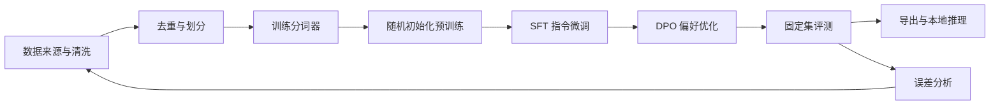

我想完整理解一个语言模型怎样形成：数据从哪里来，文本怎样变成 token，随机权重怎样开始预测下一个词，后训练怎样改变回答，以及如何判断一次改动有没有帮助。

这条线会成为我的长期核心项目。起点是一台 Apple M4、16 GB 统一内存的电脑，先用极小的 **tiny smoke 基线**检查真实训练链路，把约 **30M 参数**设为首个正式实验目标，再逐步扩大实验。**0.5B 是扩展档，是否采用由内存与吞吐实测决定。**

[打开全链路互动导读 →](/lab/model-pipeline/)

> 2026-10-04 更新：原计划从现成的 1B 级模型开始做微调。这一版加入数据治理、分词器和从随机初始化开始的预训练，并重新安排模型规模。本文记录当前设计与实施顺序；训练记录和评测结果将随项目推进补充。

## 当前可复现的起点

2026-10-04 已在本机 MPS 后端完成 **138,560 参数**的 tiny 工程验证：自写格式样本经清洗划分，只用 train 拟合 byte-level BPE，再从随机初始化完成预训练 12 步、SFT 8 步、DPO 8 步。预训练检查点另恢复到第 14 步；固定保留样本评测和新进程 CLI 加载也已验证。

这次运行只检查数据、梯度、冻结参考、保存恢复和产物能否连接；不是正式模型训练，也没有可用对话能力或持续吞吐结论。约 30M、100M 和 0.5B 均未完成训练。训练代码、原始摘要和复现命令保存在可迁移的 `projects/small-model-lab/` 中，能整体复制成独立仓库；尚未创建远端或发布权重。

## 一、完整链路：从数据出发，回到评测


```mermaid
flowchart LR
    A[数据来源与清洗] --> B[去重与划分]
    B --> C[训练分词器]
    C --> D[随机初始化预训练]
    D --> E[SFT 指令微调]
    E --> F[DPO 偏好优化]
    F --> G[固定集评测]
    G --> H[导出与本地推理]
    G --> I[误差分析]
    I --> A
```

评测贯穿各阶段：随机模型、预训练模型、SFT 模型、DPO 模型、导出后的模型都保留一个可比较的记录。

同时设立一条应用对照线：使用现成的 **Qwen2.5-0.5B 基座**，在 Apple Silicon 上尝试 LoRA/量化 LoRA。它帮助理解已有模型的适配成本；随机初始化主线负责解释模型能力从何而来。两条线分别记录数据、训练预算和结果。

## 二、先跑 tiny，再决定约 30M 的实验预算

推理、适配器微调和全参数预训练有不同的资源开销。把 0.5B 权重加载进内存，只完成了训练资源估算的一部分。

下面采用一个透明的估算口径：FP32 权重、梯度，以及 Adam 的两个 FP32 状态，共约 **16 bytes / 参数**。

| 规划规模 | 参数与优化器状态约占用 | 本项目中的用途 |
|---|---:|---|
| tiny smoke | 按实际配置计数 | 自写样本、限步数，验证工程闭环 |
| 30M | 0.45 GiB | 首个正式实验目标，先短跑测量 |
| 100M | 1.49 GiB | 比较容量、数据和训练预算 |
| 500M / 0.5B | 7.45 GiB | 完成资源测量后决定是否扩大 |

这张表**不含激活、注意力中间结果、临时张量、数据缓存、框架和操作系统**，也不包含 DPO 冻结参考模型带来的额外开销。混合精度与不同优化器会改变计算方式，因此它不是实际峰值内存预测。

硬件读取为 M4 MacBook Air（10 核 CPU、8 核 GPU、16 GB 统一内存）。2026-10-04 早期 `df` 快照显示约 12 GiB 可用空间，稍后 MPS 运行中的 `shutil.disk_usage` 记录约 37.83 GiB；时点与口径不同，不能把其中一个当作持续可用容量。0.5B 训练检查点若含 FP32 权重与两份 Adam 状态，约 515M 参数的一份约 5.75 GiB；保留两份之外还需要数据和临时文件空间。该档尚未启动，须在扩展前重新核对磁盘与内存预算。

第一版配置从短上下文、micro batch 1 和梯度累积起步。梯度累积能降低单个 micro batch 的激活需求，但不会消除参数与优化器状态的开销。

模型大小只是一个维度。小模型经过少量 token 的训练可以验证训练链路、观察 loss 和生成变化；流畅对话能力还取决于语料、分词、容量和训练预算。

## 三、两个独立项目，各自承担什么？

**small-model-lab：训练项目。** 管理数据清单、分词器、模型配置、训练入口、检查点、评测记录和推理导出。它应能在没有博客项目的环境里运行，并单独发布到 GitHub。

**这个博客：讲解与展示。** 用文章和互动图解释每一步，并展示训练项目导出的运行摘要、曲线与样例。浏览器中的预算计算和流程图属于教学与规划工具。

建议训练仓库按下面的结构逐步形成：

```text
configs/             模型规模、训练预算与评测设置
src/small_model_lab/  数据、分词、模型、训练、评测与推理模块
data/                本地语料与分词结果，默认不提交
runs/                配置快照、日志、检查点，默认不提交
reports/             可公开的结果摘要
manifests/           数据来源、版本、许可与划分规则
```

每次运行记录：代码版本、配置、随机种子、数据与分词器哈希、设备、实际 token 数、峰值内存、吞吐、检查点和评测设置。

## 四、数据：先确定模型能看到什么

先选一个小而明确的语料范围，例如中文技术说明与少量通用文本。数据来源、许可和版本写入清单，分别管理预训练文本、指令数据、偏好数据和保留评测集。

处理顺序：

1. 校验编码和字段，清除损坏记录、空文本和明显模板垃圾。
2. 规范化文本，做精确去重；规模扩大后增加近重复检查。
3. 以文档或来源组划分训练、验证和测试，避免同一文档的切片跨集合。
4. 在划分之后训练分词器与切块。
5. 固定保留评测集，检查它与各阶段训练数据的重叠。

一个预训练输入记录可以是：

```json
{"id":"doc-001","source":"local-example","license":"author-owned","group":"document-001","text":"模型通过预测下一个 token 学习文本中的规律。"}
```

这里的短文本只说明格式。训练清单还要保存源文件校验和、筛选规则、保留数量、拒绝原因和最终 token 数。

## 五、分词器：模型的一部分

第一版尝试 **8K 词表的 byte-level BPE**，仅使用训练划分拟合；实际词表大小以训练产物为准。词表、规范化规则、特殊 token 和聊天模板均需冻结并记录版本。

检查中文、英文、代码、数字和符号的编码与解码，观察每类文本的 token 长度、异常切分和特殊 token 行为。分词器改变后，模型输入和输出层也需要保持一致。

验证/测试文本可以用冻结后的分词器编码，但不能参与词表学习。不同分词器的 perplexity 不能直接横向比较。

## 六、预训练：从随机权重开始

第一版采用结构清楚的 decoder-only Transformer：因果注意力、前馈层、归一化、位置表示和共享输入输出嵌入。用 next-token cross entropy 更新全部参数。

预训练分三步推进：

- **工程小跑**：少量 step 检查数据流、因果掩码、loss、梯度、保存与恢复。
- **资源测量**：经过预热后测稳定吞吐和峰值内存，观察更长时间下的速度变化。
- **定额训练**：固定 token 预算与验证频率，保存最佳验证检查点和最新可恢复检查点。

训练时间按照实测估算：

```text
训练净时长 ≈ 计划处理 token 数 / 实测训练 tokens/s
总耗时还需加上数据处理、验证、检查点和中断恢复
```

例如，若某次配置实测为 1,000 tokens/s，处理 100M tokens 的净时间约为 27.8 小时。这只是代入公式的示例，**不是这台电脑的速度预测**。

恢复训练时还要恢复优化器、调度器、随机数状态和数据位置。只加载模型权重无法续接同一条训练轨迹。

## 七、后训练：先 SFT，再 DPO

### SFT：从续写到遵循指令

将指令样本序列化为固定聊天模板。输入包含上下文，loss 只计算 assistant 回答部分，padding 与 prompt 位置都应被正确屏蔽。

记录回答覆盖率、截断情况、验证 loss，以及固定问题的生成结果。对约 30M 的主线先研究全参数 SFT；现成 0.5B 模型的 LoRA 另作对照。

### DPO：从偏好中调整回答

每条数据包含同一个 prompt、chosen 和 rejected 回答。参考模型固定为 SFT 检查点，策略模型从同一检查点开始优化；两个模型使用相同分词器与模板。

第一轮保持样本简单、偏好理由明确，检查回答长度偏置、chosen/rejected 是否相同、prompt 是否泄漏进回答计分。固定参考模型不参与梯度更新。

DPO 的训练目标变化和保留集表现一起报告。偏好训练可能改善某些维度，也可能损害其他能力；下一步由评测结果决定。

## 八、评测：每个阶段使用同一把尺子

| 维度 | 记录内容 | 比较条件 |
|---|---|---|
| 语言建模 | 验证/测试交叉熵、perplexity | 同一语料、分词器、切块和计分方法 |
| 指令遵循 | 格式、约束与可自动核对的短任务 | 同一提示集、模板、解码设置 |
| 领域任务 | 中文技术问题的正确性、相关性和遗漏 | 固定评分规则，并检查训练数据重叠 |
| 偏好变化 | 保留偏好对的表现、人工盲评 | 同时观察长度偏置与任务退化 |
| 运行资源 | 峰值内存、训练吞吐、推理吞吐 | 标明后端、精度、batch、上下文与预热 |
| 导出一致性 | 固定输入下的输出与数值差异 | 原始检查点与导出产物分别记录 |

小模型首先用简单、可解释的任务观察变化。公开大型基准可以作为后续扩展，报告时同时说明样本数和统计不确定性。

## 九、导出、推理与下一次迭代

第一版先确保训练项目自己的推理入口能加载模型配置、权重、分词器和聊天模板，在新进程中复现固定样例。随后再研究兼容格式导出和量化。

自定义架构不会自动成为 Ollama、GGUF 或 MLX 的可加载模型。每一种转换都要确认架构支持，并单独比较输出和资源占用。

一次完整迭代留下五样东西：数据版本、训练配置、可恢复检查点、评测报告、下一轮要改变的一个因素。这个反馈过程，是这项工作与 RSI 主张连接的地方。

## 十、参考现有工作，确定实现起点

- [MiniMind](https://github.com/jingyaogong/minimind)：参考小模型的预训练、后训练与工程组织；执行前固定具体版本并检查后端要求。
- [nanochat](https://github.com/karpathy/nanochat)：参考从 tokenizer 到预训练、后训练、评测和交互的整体流程；GPU 速度示例需要与本机测量分开看。
- [LLMs from scratch](https://github.com/rasbt/LLMs-from-scratch)：对照模型、预训练和指令微调的逐步实现，理解每个模块。
- [MLX LM](https://github.com/ml-explore/mlx-lm)：作为 Apple Silicon 上现成模型推理与 LoRA 的应用对照。
- [PyTorch MPS](https://docs.pytorch.org/docs/stable/notes/mps.html)：检查 Metal 后端可用性与算子支持，以小配置决定实际实现路径。
- [Qwen2.5-0.5B](https://huggingface.co/Qwen/Qwen2.5-0.5B)：查看基座模型卡、模型配置和使用条件。

第一步是把数据、分词和训练入口固定下来，以 tiny 基线验证全链路和保存恢复。约 30M 的正式实验先做资源短跑，再确定 token 预算；100M 与 0.5B 都不预先承诺训练时间或能力。
