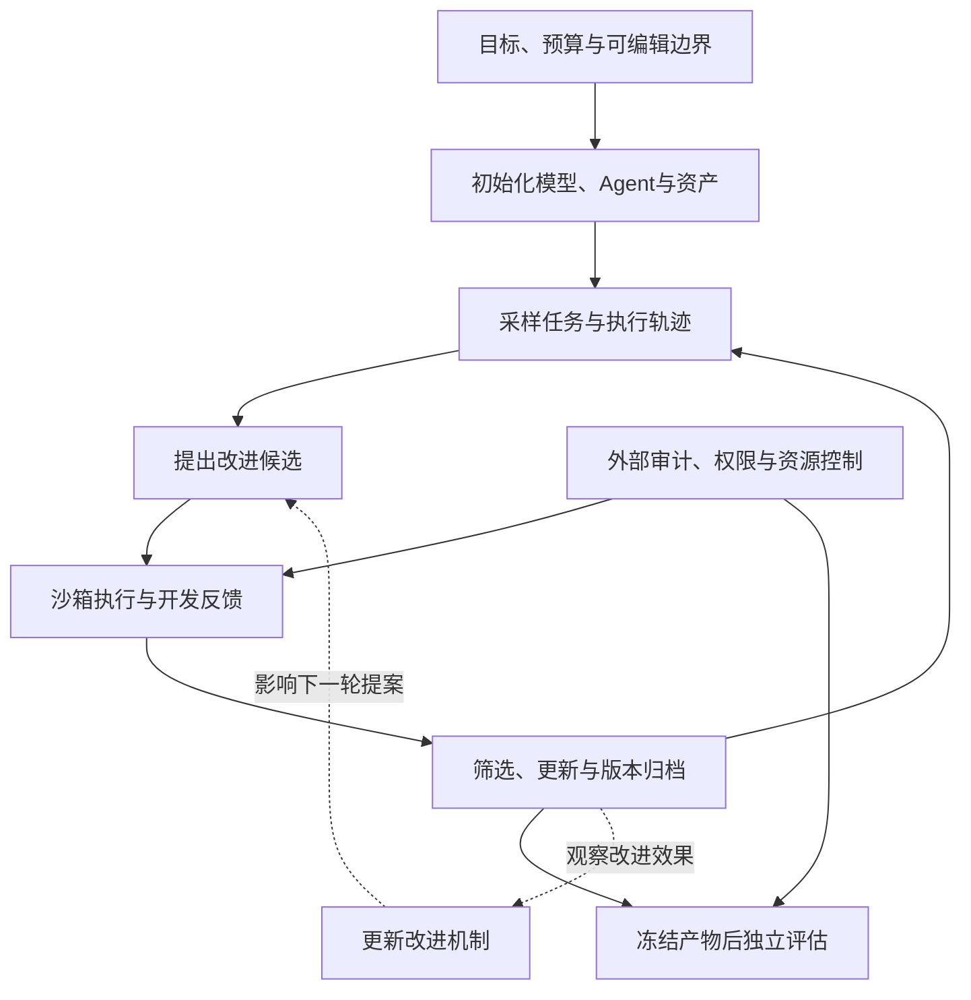

> 一个 Agent 修好了代码，下一次就一定更会修代码吗？如果它还能修改自己的提示、工具和搜索程序，是否就会越来越善于改进自己？
>
> 这两个问题之间，隔着 RSI 研究最重要的一段因果链：**当前任务做得更好，如何转化为下一轮改进做得更好。**

递归自我改进（Recursive Self-Improvement，RSI）常被放在“智能爆炸”的叙事里讨论。但把镜头拉近，今天能够研究和复现的对象很具体：一条反思提示、一套技能库、一批合成训练数据、一个会改写自己的编码 Agent，或者负责设计这些组件的元智能体。

本文将相关研究整理成一张机制地图，再沿着数据、反馈、更新、继承和评估，搭出一个完整的研究框架。先给出三个判断：

- **有限闭环的收益已有不少实证。** 在可验证任务上，生成候选、获得反馈、筛选并保留有效变化，可以提高系统表现。
- **“改进器也变强”需要额外实验。** 不能只看最终 Agent 分数，还要让新旧改进器从相同起点出发，比较它们产生下一代的能力。
- **现有结果不足以证明长期、无上界的自主加速。** 外部模型、任务分布、评估协议和资源管理，仍常由人类预先设定。

资料范围截至 **2026 年 10 月 3 日**。这是一篇选择性文献综述，结果来自原论文与官方资料，未独立复现实验。下文的六路线分类、双闭环表示和评估协议，是为比较不同工作提出的分析框架，不是领域统一标准。预印本及作者报告也不等于已经获得独立验证。

## 一、先说清楚：究竟是什么在自我改进？

### 1.1 四种不同的主张

“模型再想了一遍”“Agent 记住了错误”“训练脚本又跑了一轮”“改进程序重写了自身”，都可以形成循环，但循环留下的东西不同。

| 主张 | 发生变化的对象 | 需要观察的证据 |
|---|---|---|
| 输出修订 | 当前答案、推理或行动轨迹 | 优于等预算重试与独立采样 |
| 持久改进 | 权重、提示、记忆、技能或程序 | 新状态在未见任务上产生可重复收益 |
| 改进器改进 | 提议、搜索、筛选、课程或训练机制 | 同起点、同预算下产生更好的后代 |
| 跨代复利 | 多代系统的改进能力 | 新代真实承担后续改进，收益跨代、跨任务保持 |

例如，一个 Agent 把失败经验写进记忆，下次遇到类似问题更快解决，已经是有价值的系统级学习。若维护记忆的规则始终不变，证据主要落在“持久改进”；还需验证它是否越来越会提炼有用经验，才能进一步讨论改进器的增强。

**权重冻结并不排除系统级改进。** 提示、工具、搜索器和控制流也是系统的一部分。相反，即使每轮都更新权重，如果生成、验收和训练规则完全固定，也不能仅靠轮数证明改进机制在增强。

历史上，I. J. Good 讨论了机器设计更强机器的正反馈设想；[Gödel Machines](https://arxiv.org/abs/cs/0309048)研究在形式化条件下、证明修改有用后进行自修改。前者是概念论证，后者依赖形式系统的假设。今天名为 Gödel Agent 或 Darwin Gödel Machine 的经验系统，不因此自动获得形式化最优性保证。[Good 原文](https://doi.org/10.1016/S0065-2458%2808%2960418-0)

### 1.2 六条路线，三条横轴

为了避免按年份堆论文，可以按主要改进对象分成六条技术线。它们相互重叠，一套系统可能同时属于多条线。

| 技术路线 | 主要改变什么 | 代表工作 |
|---|---|---|
| 输出与轨迹修订 | 当前答案、行动轨迹 | Self-Refine、Reflexion |
| 非参数资产演化 | 提示、记忆、技能、工作流 | DSPy、GEPA、ACE、Voyager |
| 数据与参数自训练 | 训练材料、模型权重、更新策略 | STaR、ReST-EM、SEAL |
| 自博弈与课程生成 | 题目分布、难度、反馈组件 | AZR、R-Zero、Self-Rewarding |
| 智能体与元智能体演化 | 任务程序、改进程序 | STOP、DGM、HGM、HyperAgents |
| 自动研究与流程优化 | 实验、算法、训练基础设施 | FunSearch、AlphaEvolve、AIDE² |

跨路线比较时，再看三条横轴：

1. **反馈从哪里来？** 正确答案、程序执行、环境奖励、模型评价、人类评审，可靠性不同。
2. **状态留在哪里？** 上下文、数据库、工具代码或模型权重，更新成本和遗忘风险不同。
3. **下一代怎么选？** 单链爬坡、种群、档案、树搜索，探索能力和评估开销不同。

已有[大语言模型自演化综述](https://arxiv.org/abs/2404.14387)、[自演化 Agent 综述](https://arxiv.org/abs/2507.21046)和[递归自我改进综述](https://arxiv.org/abs/2607.07663)可用于扩展阅读。综述适合定位问题，具体结果仍应追到原始实验。

## 二、统一框架：对象层和元层两个闭环

先把系统拆开。用下面的记号帮助分析：

- $\theta_t$：第 $t$ 代基础模型或适配器权重；
- $A_t$：任务 Agent 的提示、工具接口和控制流；
- $M_t$：记忆、技能与历史经验；
- $D_t$：可用于后续更新的数据；
- $U_t$：产生和实施改进的机制；
- $E$：候选不能随意改写的外部评估与资源约束。

一次对象层更新，可以写成：

$$
S_{t+1}=U_t(S_t,D_t;B),\qquad S_t=(\theta_t,A_t,M_t)
$$

其中 $B$ 是这次更新的资源预算。普通自训练、提示优化和代码演化，都可以放进这个形式。更强的递归问题则是：**$U_t$ 本身如何变化，变化后能否更有效地产生下一次更新？**

图中的实线构成对象层闭环，虚线体现元层关系。它是本文提出的通用示意，并非某篇论文的原始架构。

读每个系统时，都应追问“谁提供能力”：提案是否调用更强教师？评分是否需要标准答案？代码执行器由谁写？错误由谁人工修复？这些依赖不会因为系统自称 autonomous 或 zero-data 就消失。

另外，$E$ 不必永远只是一段静态代码；研究也可以优化评价器。但用于证明进步的最终审计锚点必须独立，否则很难分清能力增长与评分标准漂移。

## 三、路线一与二：从修改答案到积累可复用资产

### 3.1 Self-Refine 与 Reflexion：反馈最终留在哪里？

[Self-Refine](https://arxiv.org/abs/2303.17651)让模型生成初稿、给出反馈、再次修订，主要改变当前输出。[Reflexion](https://arxiv.org/abs/2303.11366)把反馈转成语言记忆，影响后续尝试。两者提供了简单而重要的闭环接口。

它们首先需要回答一个朴素的问题：同样多的调用预算，反思是否优于多试几次？如果新增收益来自更多采样，就不应全部归因于反思机制。记忆是否跨题保留、是否包含上一题的标准答案，也会影响实验解释。

无外部反馈的自纠错并不稳定。[Cannot Self-Correct Reasoning Yet](https://arxiv.org/abs/2310.01798)在所测模型与设置中发现失败和退化；[SCoRe](https://arxiv.org/abs/2409.12917)则通过多轮在线强化学习训练纠错策略。合理结论是：纠错效果依赖训练与反馈条件，不能把“再想一遍”当作可靠学习算法。

### 3.2 DSPy 与 GEPA：把提示优化变成可比较的程序

[DSPy](https://arxiv.org/abs/2310.03714)把多次模型调用组织成模块化程序，优化示例和提示等配置；框架也支持微调，不能把整个 DSPy 简化为永不更新权重。[MIPRO](https://arxiv.org/abs/2406.11695)联合搜索指令与示例，适合作为固定优化器基线。

[GEPA](https://arxiv.org/abs/2507.19457)进一步利用执行轨迹中的丰富反馈：分析为什么失败，提出提示变体，再通过候选选择与合并保留不同优势。它把单一分数背后的诊断信息用进搜索。标题中的“可以优于强化学习”对应指定任务与预算，不能解读为普遍替代 RL；复现还应区分早期稿和扩展后的六任务版本，并计算反思模型费用。

[TextGrad](https://arxiv.org/abs/2406.07496)提供另一种组织方式：沿计算图把自然语言反馈传给可编辑文本变量。这里的“梯度”是类比，变量可以是提示、代码或答案，并不是对神经网络权重执行常规反向传播。

### 3.3 ACE 与 Voyager：经验需要维护，而不只是越存越多

[ACE](https://arxiv.org/abs/2510.04618)把经验维护为条目式 playbook，以局部增量和确定性合并减少整篇重写造成的信息流失；[Voyager](https://arxiv.org/abs/2305.16291)在 Minecraft 中积累可执行技能，结合课程和环境反馈不断探索。

一个存储成功经验的列表很容易做出来，困难在于长期维护：旧条目何时失效？相互矛盾的经验怎么处理？新增技能帮助了什么任务，又损害了什么任务？检索和上下文变长的成本是多少？

因此，资产至少应记录来源、适用条件、验证结果、调用历史和撤销记录。还要把“新增资产有用”与“管理资产的机制更有效”分开评测。前者成立时，已经可以产生工程价值，无需附加更强的递归主张。

## 四、路线三：从自生成数据到学习更新策略

### 4.1 STaR、ReST-EM 与 SPIN：循环的监督仍有来源

[STaR](https://arxiv.org/abs/2203.14465)用少量推理示例启动生成，保留答案正确的轨迹；答错时可以给出正确答案，再生成解释并微调。推理文本由模型生成，但答案提供了外部锚点。答案正确也不保证推理过程忠实。

[Self-Instruct](https://arxiv.org/abs/2212.10560)从 175 个人工种子任务扩展指令、输入与输出，经规则过滤后训练模型。它缓解新增标注需求，仍保留人工种子和预训练先验。[ReST-EM](https://arxiv.org/abs/2312.06585)采用多采样、答案或单元测试验收、正样本微调的循环；其数学设置支持有限轮迭代收益，代码任务后续轮次却出现退化。

[SPIN](https://arxiv.org/abs/2401.01335)让模型学习区分原始示范与自身回答，上一轮模型成为下一轮对手。原始示范仍定义目标分布，连续轮次的边际收益也会递减。这些工作都提醒我们：自生成可以扩展训练信号，却不会自动保证多样性、真值和无限增益。

[DeepSeek-R1](https://arxiv.org/abs/2501.12948)是强有力的固定训练管线对照。R1-Zero 无前置 SFT，仍依赖预训练、题目和正确性奖励；完整 R1 又加入冷启动等阶段。长推理、自反思行为和蒸馏学生的提升，不能直接证明模型优化了自身的 RL 算法。

### 4.2 STaR 与 SEAL：奖励的是答案，还是更新后的效果？

这组对照能直观展示元学习思路。[SEAL（Self-Adapting Language Models）](https://arxiv.org/abs/2506.10943)让模型产生 self-edit，例如训练材料或超参数，再执行参数更新，根据更新后的下游表现奖励有效编辑。

| 维度 | STaR | SEAL |
|---|---|---|
| 主要产物 | 可用于微调的推理轨迹 | 促成适应的训练材料或编辑方案 |
| 反馈落点 | 生成回答的最终答案是否正确 | 应用编辑后，下游表现是否改善 |
| 更新载体 | 模型参数 | 内循环参数更新，以及产生编辑的策略 |
| 关键代价 | 生成、筛选、微调 | 候选编辑可能逐个需要训练和评估 |

SEAL 更直接地把“如何产生有效更新”设为学习目标。它也带来昂贵的内循环、更新归因和遗忘问题。尤其需要注意：论文简化 ARC 实验的 **72.5%**，是筛选后 **8 个评估任务、每题 5 个编辑**设置下的编辑成功率，不能写成完整 ARC 基准得分。

### 4.3 更新策略不一定以权重形式存在

[Learning to Self-Evolve（LSE）](https://arxiv.org/abs/2603.18620)根据执行经验提出新指令，以新旧指令在留出集上的收益差训练改进器。部署阶段搜索和编辑上下文，不更新执行模型权重。它主要优化一跳近似，长期多代效果仍需验证。其 BIRD 对照固定同一个 Qwen3-4B 执行模型，比较的是不同改进器的上下文优化效果，不是裸模型综合能力的胜负。

[Meta-TTL](https://arxiv.org/abs/2604.00830)在内层修订任务提示，在外层选择元提示；主实现采用无梯度优化，部署时冻结学到的元提示。它与 SEAL、LSE 的共同点，是关注更新带来的收益；不同点是学习发生的位置、更新载体与成本。

要检验这类方法，除了比较更新后的任务分数，还应让旧改进器和新改进器处理相同起始状态，并测试新任务家族。否则更好的执行模型、更好的初始提示与更好的改进策略会混在一起。

## 五、路线四：任务与裁判也进入闭环

### 5.1 AZR 与 R-Zero：最关键的区别是真值

[Absolute Zero Reasoner（AZR）](https://arxiv.org/abs/2505.03335)让模型提出程序、输入和输出相关任务，再求解这些任务；Python 执行器提供验证，奖励同时关心出题的可学性和解题正确性。它的 zero data 指不依赖外部后训练题库，仍有预训练、任务语言、执行规则和初始化示例。

[R-Zero](https://arxiv.org/abs/2508.05004)交替训练 Challenger 和 Solver，以回答一致性调整难度，并通过多数票形成伪答案。它扩大了任务生成空间，也面对错误共识：**一半回答一致，不等于一半回答正确。**

| 问题 | AZR | R-Zero |
|---|---|---|
| 验收主要依据 | 程序执行结果 | 解答一致性与多数票伪标签 |
| 优势 | 部分任务的真值较易检查 | 任务生成不局限于同一种执行形式 |
| 主要风险 | 可执行空间覆盖有限 | 多模型或多样本一起认错 |

评价课程时，平均难度只是一个维度。还应检查可验证比例、伪标签错误率、概念覆盖、近重复、对外部固定任务的迁移，以及相对冻结初代出题者的增益。

### 5.2 评价器能学习，但多一层裁判不会自动产生真值

[Constitutional AI](https://arxiv.org/abs/2212.08073)用人工原则指导批评、修订和偏好生成，仍保留人类有用性反馈；[Self-Rewarding](https://arxiv.org/abs/2401.10020)让模型生成回答并评分；[Meta-Rewarding](https://arxiv.org/abs/2407.19594)进一步学习评价的偏好。

这些方法把部分监督内部化，必须继续检查启动数据、固定出题模型、评分提示和长度偏差。Self-Rewarding 的非长度控制胜率，不能直接与 Meta-Rewarding 的长度控制胜率相减；后者也并非每轮都持续训练元裁判。

[Self-Taught Evaluators](https://arxiv.org/abs/2408.02666)通过扰动指令构造较差回答，生成并筛选判断理由，训练评价器。构造任务提供了排序锚点，却不覆盖所有真实偏好。裁判在现成基准上更准之后，还应测试：当求解模型主动迎合它时，它能否继续保持可靠。

## 六、路线五：Agent 改代码之后，谁来证明改进器变强了？

### 6.1 从固定设计者到可编辑改进程序

[STOP](https://arxiv.org/abs/2310.02304)是清晰的自指例子：用固定语言模型实现程序改进函数，再把这个函数自身作为优化对象，以改善下游程序的效用作为元目标。函数可变，模型、任务效用与资源限制仍固定。

[ADAS](https://arxiv.org/abs/2408.08435)让元智能体读取历史设计、编写新 Agent、评估并归档，搜索程序结构、角色和调用流程。负责设计的元智能体保持固定，因此它是研究递归机制时非常重要的对照。

[Gödel Agent](https://arxiv.org/abs/2410.04444)开放策略和部分改进逻辑；[SICA](https://arxiv.org/abs/2504.15228)让同一个编码 Agent 负责解题与修改自身，效用同时考虑正确率、成本和时间。后者的 SWE-bench Verified 数字来自随机子集，不能当作完整 500 题成绩。

### 6.2 DGM 与 HGM：为什么当前赢家未必是最好的祖先？

[Darwin Gödel Machine（DGM）](https://arxiv.org/abs/2505.22954)从档案选取父代理，让其修改自身程序，评估后把新版本加入档案。保留分叉和暂时较弱的候选，可以利用后续可能有价值的“垫脚石”，避免只沿当前最佳解前进。

DGM 的 SWE-bench 实验使用分阶段子集，不能将阶段分数标成完整 Verified 500 题成绩。冻结基座上的程序演化属于持久系统改进，但编码任务成绩仍只是后续自修改能力的代理指标；外层产生改进指令的机制也有固定部分。

[Huxley-Gödel Machine（HGM）](https://arxiv.org/abs/2510.21614)进一步关注后代生产力：一个代理当前得分一般，仍可能产出优秀后代。它利用后代群的成功统计估计这种潜力，并通过 Thompson sampling 分配搜索和追加评价预算。理论关联依赖特定假设，实际系统使用估计器，不能称为通用可证明最优机器。

### 6.3 ADAS 与 HyperAgents：关键在可编辑对象和评测方式

[HyperAgents](https://arxiv.org/abs/2603.19461)将任务 Agent 和元 Agent 放进同一可编辑程序，使候选不仅改变解题过程，还能修改下一轮如何提出改进。

| 维度 | ADAS | HyperAgents |
|---|---|---|
| 任务 Agent | 可搜索、可替换 | 可搜索、可替换 |
| 元 Agent | 固定设计者 | 进入可编辑对象 |
| 关键实验问题 | 自动设计的 Agent 是否更好 | 修改后是否更会产生后续改进 |
| 仍需控制的条件 | 模型、任务、预算、选择过程 | 同样需要控制，且要隔离元层贡献 |

HyperAgents 的 Improvement@k 在固定起点与预算下测后代增益，比只看任务分数更直接。它涉及编码、论文判断、奖励设计和数学评分等任务。但基础模型、父代选择、评价协议和任务分布仍有固定部分，因此应表述为有限设置下的元改进证据。

这条路线还有不同时间尺度的分支：[Live-SWE-agent](https://arxiv.org/abs/2511.13646)主要在当前 issue 内合成工具，外层循环不变；[Polaris](https://arxiv.org/abs/2603.23129)从失败经验提炼策略并施加最小补丁；[DarwinX](https://arxiv.org/abs/2608.07545)强调 harness 演化、分层评估与能力保持。它们都值得研究，但需要逐一确认跨任务继承和元层收益，不能只依据 self-evolving 的标题归类。

## 七、路线六：自动科研怎样接回自身改进？

[FunSearch](https://www.nature.com/articles/s41586-023-06924-6)把冻结代码模型、程序骨架、自动评价和候选档案结合，借助强验证器搜索算法。[AlphaEvolve](https://arxiv.org/abs/2506.13131)将类似思路扩展到数学、算法与计算基础设施。[AI Scientist-v2](https://arxiv.org/abs/2504.08066)则覆盖假设、实验代码、运行、分析和论文写作，以树搜索管理研究过程。

这类工作为 RSI 提供候选生成和实验执行能力。要进一步证明递归收益，需要把链路接完整：

**提出方法 → 独立验证 → 部署回后继系统 → 后继系统更有效地继续研究。**

优化了外部排序程序，不能直接推出科学家自身变强；完成一篇论文，也不等于研究方法已经进入下一代。AlphaEvolve 官方报告的特定 kernel 提速 23%、总训练时间下降 1%，分别是算子与训练效率口径，不能改写成模型智能提升 23%。[官方说明](https://deepmind.google/blog/alphaevolve-a-gemini-powered-coding-agent-for-designing-advanced-algorithms/)

### AIDE²：正面结果与不确定结果应一起读

[AIDE²：Recursive self-improvement of AI research agents](https://arxiv.org/abs/2609.26457)用固定外层 AIDE 改写内层研究代理，在固定预算与分离评分下改善研究表现，并测试迁移。主实验的外层设计、选择机制和两层基础模型均冻结。

更关键的是独立的 ignition 实验：让演化出的代理担任外层改进者，与原外层从同一起点比较。每组 **3 个种子、50 步**，终点均值约为 **0.780 与 0.782**；作者认为证据不确定。这两个数也不能证明新旧系统等价，样本有限仍可能没有足够统计功效。

因此，主实验支持研究优化器可以被优化，却尚未确立改进器递归加速。先期博客与正式预印本的数值有修订，引用时应采用同一版本；专属完整实验代码也未核实，祖先 AIDE 开源不能替代本实验的开放性证明。

## 八、把全链路落地：一个可审计的最小实验

下面是建议方案，用于说明各环节怎样连接，**不是已经运行的实验**。研究问题可以收窄为：冻结基础模型，改进代码 Agent 的提示、工具与搜索策略，观察任务能力和改进能力是否分别提高。

### 8.1 目标、初始化与权限

先固定任务家族、基础模型版本、工具、总预算和可编辑边界。建立初始 Agent、初始改进器和未优化基线。候选只能修改指定工作区中的提示、工具或搜索程序；隐藏测试、评分服务、计时器、权限和日志归档由外层控制。

安全隔离不应依赖一句“不要修改测试”的提示。应使用独立评估环境、只读资源、受限网络和执行沙箱；候选代码的权限不能由候选自行扩大。

### 8.2 经验采样与改进提议

先运行开发任务，保存成功和失败轨迹。改进器读取允许访问的诊断信息，提出可审查的补丁，并标注改动对象、预计作用与适用条件。

例如，反复定位错文件时，可以提出修改检索顺序；大量超时来自无效重试时，可以调整搜索策略。这样的改进理由只是待验证假设，不能把模型的自我解释当作结果证据。

### 8.3 候选验证、筛选与更新

对候选先做语法、接口、资源与安全检查，再运行开发评估。保留失败候选、崩溃与拒绝原因，不能只存赢家。若采用档案机制，还应记录父子关系和选择概率，区分最高分候选与有探索价值的分支。

加入参数更新后，流程还要记录样本筛选、数据比例、训练步数、适配器版本和旧能力回归。训练失败、无效编辑和反思调用都计入成本。

### 8.4 冻结、评估、继承与停止

搜索结束后冻结产物，才在未参与选择的任务上评估。随后检查多起点下的改进器能力：把各代改进器放到相同的一组初始 Agent 上，比较它们产生的后代。

这一步很重要。沿一条谱系观察到下一代更强，可能只是起点变好了；共同起点评测才能隔离改进策略本身的作用。

最后保存可回滚版本，并按预先声明的规则停止：预算耗尽、持续无有效进展、能力保持不达标、安全约束触发或环境无法重建。不能看到理想曲线后，才决定本轮实验恰好到这里结束。

一条最小审计记录应包含：

| 类别 | 必须留下的信息 |
|---|---|
| 身份与谱系 | 候选 ID、父代、代码或资产差分、模型版本 |
| 数据与反馈 | 数据切分、可见字段、执行轨迹、评分版本 |
| 决策 | 接受或拒绝原因、人工介入、回滚记录 |
| 成本 | 提案、反思、训练、执行、筛选、复测的全部开销 |
| 结果 | 留出成绩、迁移、旧能力、安全与失败事件 |

## 九、数据集清单还不够：必须画出 train–reward–dev–test

同一个基准在不同论文里可能承担完全不同的角色。用于生成训练样本、用于决定是否保留候选、用于最终盲测，都在使用数据，但不是同一件事。

### 9.1 六种数据角色

| 角色 | 作用 | 常见混淆 |
|---|---|---|
| 种子与训练集 | 初始化、SFT、偏好训练 | “没有新增人工标注”被写成没有监督 |
| 在线生成集 | 新任务、轨迹、解释或伪标签 | 自生成被默认视为正确、独立、多样 |
| 奖励与验证信号 | 标准答案、单元测试、模型评价 | 通过测试被当作全面正确 |
| 开发选择集 dev | 选择提示、补丁、模型与超参数 | 反复访问仍被称为未见数据 |
| 最终盲测集 test | 冻结系统后审计 | test 分数反过来指导下一轮设计 |
| 迁移与保持集 | 新领域与旧能力回归 | 同模板新题被当作远迁移 |

如果某个 test 被反复用于挑候选，它已经在提供训练或选择信息。名字叫 test，并不能保证独立性。对闭源模型，也通常无法证明其训练语料完全无污染，应明确披露这一不确定性。

### 9.2 代表论文实际使用的数据流

下表汇总原论文报告的角色，不是推荐的统一复现实验；精确切分、版本与样本量仍需固定原文和官方配置。

| 方法 | 训练或改进输入 | 奖励与选择 | 评估及限定 |
|---|---|---|---|
| [STaR](https://arxiv.org/abs/2203.14465) | 少量推理示例、带答案问题 | 最终答案验收 | CommonsenseQA 开发集、GSM8K 测试集 |
| [ReST-EM](https://arxiv.org/abs/2312.06585) | MATH 7,500 题、APPS 2,342 道入门题 | 答案、单元测试与正样本筛选 | MATH、APPS；后续代码轮次可退化 |
| [Self-Rewarding](https://arxiv.org/abs/2401.10020) | 指令与评价启动数据、自生成回答 | 同模型评分形成偏好 | AlpacaEval 2 非长度控制胜率 |
| [SEAL](https://arxiv.org/abs/2506.10943) | 新上下文与自生成编辑 | 更新后的标注任务表现 | SQuAD、筛选后的简化 ARC |
| [LSE](https://arxiv.org/abs/2603.18620) | 任务经验与上下文编辑 | 留出集中新旧提示的收益差 | 包含 BIRD 五数据库设置 |
| [AZR](https://arxiv.org/abs/2505.03335) | 自生成程序、输入与输出任务 | 执行真值和可学性 | 外部数学与代码任务 |
| [DGM](https://arxiv.org/abs/2505.22954) | 代理程序档案与轨迹 | 分阶段任务成绩用于选择 | SWE-bench 子集、Polyglot 等 |

DGM 的选择反馈可以给搜索带来训练信息，但不应因此把其基准清单写成 SFT 数据集。SEAL、LSE 奖励的是更新效果，也不能把它们的奖励集混同为最终盲测集。

### 9.3 评估应覆盖不同层次

- [ARC](https://arxiv.org/abs/1911.01547)：少样本抽象与新规则获取，要报告尝试预算；不要与 AI2 科学问答 ARC 混用。
- [LiveCodeBench](https://arxiv.org/abs/2403.07974)：局部代码生成与修复，要固定时间切片与模型信息。
- [SWE-bench](https://arxiv.org/abs/2310.06770)：真实仓库问题解决，要固定仓库快照、测试、容器和网络权限。
- [GAIA](https://arxiv.org/abs/2311.12983)：跨工具、浏览与多模态协作，要处理网页漂移和隐藏答案。
- [MLAgentBench](https://arxiv.org/abs/2310.03302)：机器学习实验流程，原始 13 项任务；隐藏评分脚本必须隔离。
- [RE-Bench](https://arxiv.org/abs/2411.15114)：研究工程与资源效率，原始 7 个环境；人机比较依赖时间预算。
- [PaperBench](https://arxiv.org/abs/2504.01848)：论文理解与复现，原始 20 篇论文；需审计评委可靠性与实际实验执行。

这些基准主要测任务能力，不是现成的 RSI 认证。研究元改进，还需要在它们之上建立“改进者测试集”：共同起点、未见任务家族、固定总预算和独立后代评估。

**SWE-bench Verified 还需特别留意时效性。** [OpenAI 在 2026 年 2 月的审计](https://openai.com/index/why-we-no-longer-evaluate-swe-bench-verified/)指出污染和残余评测缺陷，并转向推荐 SWE-bench Pro。文中的 59.4% 来自对 138 个特定未稳定解决问题的定向审计，不能外推为全部 500 题的无效率。Verified 仍可用作历史比较切片，但应增加新时间段、新仓库与隐藏修复；换用新基准也不能永久解决污染。

## 十、可信评估：把“分数上涨”拆成可检验的因果问题

### 10.1 分别测任务能力与改进能力

任务能力 $Q_t$ 是第 $t$ 代系统在独立任务上的表现。改进能力可以作如下操作性定义：

$$
R_t(B)=\mathbb{E}_{s\sim P_{\mathrm{start}}}
\left[Q_H\bigl(U_t(s;B)\bigr)-Q_H(s)\right]
$$

这里 $P_{\mathrm{start}}$ 是共同起始系统的分布，$H$ 是改进器不可访问的留出任务，$B$ 包括产生和选择候选所需的搜索、训练与执行预算。$Q_H$ 在最终审计时计算，其评估开销也应单独记账并保持一致。

这不是通用智能的数学定义，而是一个比较实验：旧改进器与新改进器拿到同样的起点和资源，谁产生的后代更好？还应报告分布和置信区间，不能只比较均值。

### 10.2 最小对照组

| 对照 | 排除什么解释 |
|---|---|
| 冻结系统，增加等预算重试 | 收益只是多花推理计算 |
| 一直使用初代改进器 | 固定优化器反复运行已足够 |
| 同预算随机或规则搜索 | 智能提案没有贡献额外价值 |
| 只改任务模块、冻结元模块 | 执行器变强被误记为改进器变强 |
| 只改元模块、使用共同执行起点 | 起始 Agent 不同造成混淆 |
| 固定教师、数据和模型版本 | 外部知识注入或模型升级造成收益 |

训练路线还应比较多轮生成与一次性等量生成、冻结初代生成器与更新生成器，并控制训练计算。只对齐轮数，没有对齐信息量和总预算，通常不够。

### 10.3 看完整曲线，不只看最高点

Best-so-far 曲线按构造就不会下降，因为它记录“截至目前见过的最好结果”。它不能证明每代都进步，更不能证明增长加速。

至少同时报告：

1. **质量**：留出成功率、不同任务家族的分布、迁移与旧能力退化。
2. **效率**：总成本、达到同一质量所需成本、墙钟时间与人工分钟数。
3. **递归性**：各代改进器在共同起点上的后代增益，以及多代继承效果。
4. **可靠性**：失败、崩溃、回滚、奖励利用、安全事件和长尾覆盖。

预先声明随机种子、预算、停止规则和主指标；采用成对比较，并考虑任务家族、谱系内部的相关性。计算 token、GPU 时间或美元成本时，应保留各项明细，不把不同资源未经说明揉成一个分数。

若要声称“加速”，需要进一步比较每单位总资源的改进速率。更高终点、多跑几代和更陡的代数曲线，都可能只是投入增加。

## 十一、三个容易被忽略的边界

### 11.1 合成数据的风险依赖更新方式

[模型坍塌研究](https://www.nature.com/articles/s41586-024-07566-y)展示了特定递归训练设置中的分布尾部退化，正式引用需同时留意[作者更正](https://www.nature.com/articles/s41586-025-08905-3.pdf)。[累积真实与合成数据的研究](https://arxiv.org/abs/2404.01413)则说明，保留原始数据与逐代替换会产生不同结果。

因此需要记录来源、原始与合成比例、去重、长尾覆盖和过滤规则。“合成数据必然坍塌”过强，“保留原数据就能无限进步”也没有依据。

### 11.2 评价器既是量尺，也是攻击面

[奖励模型过优化研究](https://arxiv.org/abs/2210.10760)说明代理奖励可以与参考奖励逐渐偏离；参考奖励模型本身也只是实验代理，不能视为真实效用。

[Trusting Trust Revisited](https://arxiv.org/abs/2609.17817)进一步给出自修改编码代理的安全概念验证：被污染的基准可能诱导持久安全缺陷，并沿后代保留。这是特定威胁模型下的反例，提醒我们功能得分与安全正确性必须分别测试。

应独立记录访问参考补丁、修改测试、跳过断言、伪造日志和改变计时规则等行为。允许修改自身程序，不等于允许修改证明自己进步的证据。

### 11.3 论文公开、代码公开与可复现是不同维度

开放性至少要拆开看：论文、对应实现、模型权重、训练与生成数据、运行环境、预算和独立复现。不能看到 GitHub 链接就统一标成“完整开源”。

几个具体例子：

- [FunSearch 仓库](https://github.com/google-deepmind/funsearch)不包含语言模型、不可信代码沙箱和内部并行设施。
- [AlphaEvolve 结果仓库](https://github.com/google-deepmind/alphaevolve_results)提供结果与验证材料，不包含运行完整搜索系统的代码。
- [DeepSeek-R1](https://github.com/deepseek-ai/DeepSeek-R1)公开权重与推理说明，不代表完整原训练数据与管线公开。
- 有代码但依赖历史闭源 API 的实验，也可能无法精确重建。

复现材料应锁定论文版本、代码 commit、模型标识、数据 hash、环境、随机种子、全部候选与父子关系，以及人工介入和成本。本文中“未核实”表示证据不足，不能改写成确认没有公开；提供代码入口也不等于完成许可证审计或运行验证。

## 十二、如何继续读，以及从哪里开始实验？

相关基础可以结合本站的[LLM 训练技术详解](/posts/2024-09-15-llm训练技术详解/)、[LLM Agent 开发指南](/posts/2024-10-13-llm-agent开发指南/)、[Alpha Zero 算法实现五子棋](/posts/2024-6-30-alpha-zero算法实现五子棋/)和[1B 模型全链路实验计划](/posts/2026-07-08-1b模型全链路实验计划/)阅读，分别补充训练、工具化执行、自博弈与小模型实验的背景。

如果先建立概念，建议沿着 **Self-Refine / Reflexion → STaR → STOP / ADAS → DGM / HyperAgents** 阅读。每篇只先回答五个问题：改什么、反馈从哪里来、哪些东西固定、如何留出、全部成本是多少。

如果重点是后训练，读 **ReST-EM → Self-Rewarding → AZR / R-Zero → SEAL / LSE / Meta-TTL**，把训练集、奖励集和选择集画成数据流，再检查部署阶段是否仍依赖标签。

如果准备做小规模工程实验，可以按问题选择起点，而不必直接开放全部自修改权限：

- 已有模块化任务与可靠指标：比较 [DSPy](https://github.com/stanfordnlp/dspy) 的固定优化器与 [GEPA](https://github.com/gepa-ai/gepa)。
- 需要跨任务积累经验：参考 [ACE](https://github.com/ace-agent/ace) 的条目化维护与 [Voyager](https://github.com/MineDojo/Voyager) 的技能验证。
- 任务能被低成本执行验证：参考 FunSearch 的受限程序空间与档案机制。
- 关注元改进：围绕新旧改进器的共同起点评测设计实验，并以 HGM、HyperAgents 和 AIDE² 的不同证据路径作比较。

这些是依据机制提出的研究起步建议，不是已经完成的选型跑分。一个范围窄、成本透明、失败谱系完整的实验，往往比一条难以归因的漂亮曲线更有解释力。

RSI 最值得关注的变化，是研究对象正在从“找到更好的答案和 Agent”，延伸到“找到更有效的改进方法”。这条链路已经有可以拆解、实现和检验的技术组件。下一步的关键，是让任务收益、元层收益、跨域迁移和长期保持分别经得起独立验证。

**判断一个系统是否真正更会自我改进，最直接的办法，是把它重新放回改进者的位置。**

## 附录：论文、代码与基准索引

展开完整索引：42篇核心论文、5篇补充研究与7个基准入口

资料核查截至 **2026 年 10 月 3 日**。以下是本文相关的 42 篇核心论文与综述，按阅读主题分组，序号用于资料定位。首次公开日期与正式出版日期可能不同，特别差异已注明。

“代码公开”仅表示已核实作者或机构的实现入口；未逐项审计许可证，也未运行复现。未单列的权重、数据和完整训练配置不能默认已开放。“未核实”表示证据不足，不代表确认不存在。

### 概念与综述

- **01. [Speculations Concerning the First Ultraintelligent Machine](https://doi.org/10.1016/S0065-2458%2808%2960418-0)**（1965 通常引用年）  
  阅读重点：概念起点 机器设计的正反馈设想。  
  公开资源与边界：[机构归档](https://vtechworks.lib.vt.edu/items/5085379d-b24c-424e-8861-e70a47b4b2fb/full)公开；出版商元数据为1966；代码与权重不适用。

- **02. [Gödel Machines](https://arxiv.org/abs/cs/0309048)**（2003-09-25）  
  阅读重点：形式证明后自修改 理论锚点。  
  公开资源与边界：理论文本公开；不是可直接复现的现代LLM系统。

- **03. [A Survey on Self-Evolution of Large Language Models](https://arxiv.org/abs/2404.14387)**（2024-04-22）  
  阅读重点：综述 经验获取 筛选 更新 评估。  
  公开资源与边界：论文公开；综述不产生可比较的系统权重或实验代码。

- **04. [A Survey of Self-Evolving Agents: What, When, How, and Where to Evolve on the Path to Artificial Super Intelligence](https://arxiv.org/abs/2507.21046)**（2025-07-28）  
  阅读重点：综述 对象 时机 方法 场景。  
  公开资源与边界：论文公开；核实v4为2026-01-16；ASI是愿景。

- **05. [Recursive Self-Improvement in AI: From Bounded Self-Refinement to Autonomous Research Loops](https://arxiv.org/abs/2607.07663)**（2026-07-08）  
  阅读重点：综述 递归边界与研究闭环。  
  公开资源与边界：[目录仓库](https://github.com/deepgrounding/recursive-self-improvement)公开；语料链接有迁移；未独立审计全部样本。

### 输出、记忆与程序化提示

- **06. [Self-Refine: Iterative Refinement with Self-Feedback](https://arxiv.org/abs/2303.17651)**（2023-03-30）  
  阅读重点：当前输出修订 反馈回路基线。  
  公开资源与边界：[作者代码](https://github.com/madaan/self-refine)公开；历史闭源模型API影响精确复现。

- **07. [Reflexion: Language Agents with Verbal Reinforcement Learning](https://arxiv.org/abs/2303.11366)**（2023-03-20）  
  阅读重点：语言反思与情节记忆。  
  公开资源与边界：[作者代码](https://github.com/noahshinn/reflexion)公开；底座与环境是外部依赖。

- **34. [DSPy: Compiling Declarative Language Model Calls into Self-Improving Pipelines](https://arxiv.org/abs/2310.03714)**（2023-10-05）  
  阅读重点：声明式模块与可编译优化。  
  公开资源与边界：[框架](https://github.com/stanfordnlp/dspy)公开；优化器 模型 索引和数据切分须另固定。

- **35. [Optimizing Instructions and Demonstrations for Multi-Stage Language Model Programs](https://arxiv.org/abs/2406.11695)**（2024-06-17）  
  阅读重点：MIPRO 指令与示例联合搜索。  
  公开资源与边界：[MIPROv2文档](https://github.com/stanfordnlp/dspy/blob/main/docs/docs/api/optimizers/MIPROv2.md)公开；后续实现与原论文区分。

- **36. [GEPA: Reflective Prompt Evolution Can Outperform Reinforcement Learning](https://arxiv.org/abs/2507.19457)**（2025-07-25）  
  阅读重点：轨迹反思 提示演化与合并。  
  公开资源与边界：[框架](https://github.com/gepa-ai/gepa)及[论文实验](https://github.com/gepa-ai/gepa-artifact)公开；锁定六任务版本与反思成本。

- **37. [TextGrad: Automatic “Differentiation” via Text](https://arxiv.org/abs/2406.07496)**（2024-06-11）  
  阅读重点：文本反馈沿计算图传播。  
  公开资源与边界：[官方代码](https://github.com/zou-group/textgrad)公开；反馈引擎与真实评估器仍需配置。

- **38. [Voyager: An Open-Ended Embodied Agent with Large Language Models](https://arxiv.org/abs/2305.16291)**（2023-05-25）  
  阅读重点：环境课程与可执行技能库。  
  公开资源与边界：[官方代码](https://github.com/MineDojo/Voyager)公开；依赖Minecraft 版本化mod与模型API。

- **39. [Agentic Context Engineering: Evolving Contexts for Self-Improving Language Models](https://arxiv.org/abs/2510.04618)**（2025-10-06）  
  阅读重点：ACE 条目化上下文与增量合并。  
  公开资源与边界：[官方实现](https://github.com/ace-agent/ace)公开；在线顺序 重置规则和Reflector能力需固定。

### 数据、参数与评价器

- **08. [STaR: Bootstrapping Reasoning With Reasoning](https://arxiv.org/abs/2203.14465)**（2022-03-28）  
  阅读重点：参数自训练 正确答案验收。  
  公开资源与边界：[作者代码](https://github.com/ezelikman/STaR)公开；需要示例与正确答案；未核验完整权重数据包。

- **09. [Self-Instruct: Aligning Language Models with Self-Generated Instructions](https://arxiv.org/abs/2212.10560)**（2022-12-20）  
  阅读重点：合成指令池与微调。  
  公开资源与边界：[代码与数据](https://github.com/yizhongw/self-instruct)公开；原GPT3模型依赖影响重现。

- **10. [Constitutional AI: Harmlessness from AI Feedback](https://arxiv.org/abs/2212.08073)**（2022-12-15）  
  阅读重点：原则指导的修订与AI偏好。  
  公开资源与边界：论文公开；完整原训练代码 权重和数据未核实。

- **11. [Beyond Human Data: Scaling Self-Training for Problem-Solving with Language Models](https://arxiv.org/abs/2312.06585)**（2023-12-11）  
  阅读重点：ReST EM 执行验收后自训练。  
  公开资源与边界：论文公开；使用PaLM2；完整原训练发布未核实。

- **12. [Self-Play Fine-Tuning Converts Weak Language Models to Strong Language Models](https://arxiv.org/abs/2401.01335)**（2024-01-02）  
  阅读重点：SPIN 示范锚定的自博弈。  
  公开资源与边界：[官方代码](https://github.com/uclaml/SPIN)公开；原示范数据和训练资源仍需取得。

- **13. [Self-Rewarding Language Models](https://arxiv.org/abs/2401.10020)**（2024-01-18）  
  阅读重点：回答与自评分共同更新。  
  公开资源与边界：[官方目录](https://github.com/facebookresearch/RAM/blob/main/projects/README.md)列出论文；完整对应训练实现未核实。

- **14. [Meta-Rewarding Language Models: Self-Improving Alignment with LLM-as-a-Meta-Judge](https://arxiv.org/abs/2407.19594)**（2024-07-28）  
  阅读重点：学习回答偏好与评价偏好。  
  公开资源与边界：[官方目录](https://github.com/facebookresearch/RAM/blob/main/projects/README.md)列出论文；完整原训练代码未核实。

- **15. [Self-Taught Evaluators](https://arxiv.org/abs/2408.02666)**（2024-08-05）  
  阅读重点：合成评价样本训练裁判。  
  公开资源与边界：[代码与发布说明](https://github.com/facebookresearch/RAM/tree/main/projects/self_taught_evaluator)公开；完整复现依赖仍需核查。

- **16. [DeepSeek-R1: Incentivizing Reasoning Capability in LLMs via Reinforcement Learning](https://arxiv.org/abs/2501.12948)**（2025-01-22）  
  阅读重点：可验证奖励下的固定RL管线。  
  公开资源与边界：[权重与推理说明](https://github.com/deepseek-ai/DeepSeek-R1)公开；不等于完整原训练数据与管线公开。

- **18. [Self-Adapting Language Models](https://arxiv.org/abs/2506.10943)**（2025-06-12）  
  阅读重点：SEAL 学习有效参数更新指令。  
  公开资源与边界：[官方代码](https://github.com/Continual-Intelligence/SEAL)公开；候选内循环训练昂贵；小ARC切分需复核。

- **20. [Learning to Self-Evolve](https://arxiv.org/abs/2603.18620)**（2026-03-19）  
  阅读重点：训练上下文改进器 部署时改提示。  
  公开资源与边界：[官方代码](https://github.com/chenyn66/learning-to-self-evolve)含配置 数据 脚本；未执行复现。

- **21. [Meta-TTL: Meta-Learning Self-Improvement Policies for Language Agents](https://arxiv.org/abs/2604.00830)**（2026-04-01）  
  阅读重点：梯度自由元提示学习。  
  公开资源与边界：[代码](https://github.com/zzzlou/meta-ttl)公开；核实v4为2026-09-28；依赖外部模型API。

### 自博弈与课程

- **17. [Absolute Zero: Reinforced Self-play Reasoning with Zero Data](https://arxiv.org/abs/2505.03335)**（2025-05-06）  
  阅读重点：AZR 自出题 自求解 执行真值。  
  公开资源与边界：[代码 模型 日志](https://github.com/LeapLabTHU/Absolute-Zero-Reasoner)公开；原论文应固定paper分支和训练环境。

- **19. [R-Zero: Self-Evolving Reasoning LLM from Zero Data](https://arxiv.org/abs/2508.05004)**（2025-08-07）  
  阅读重点：出题与求解交替 一致性伪标签。  
  公开资源与边界：[训练代码](https://github.com/Chengsong-Huang/R-Zero)公开；完整权重与生成数据包未完整核验。

### Agent与元Agent程序演化

- **22. [Self-Taught Optimizer (STOP): Recursively Self-Improving Code Generation](https://arxiv.org/abs/2310.02304)**（2023-10-03）  
  阅读重点：改进函数应用到自身。  
  公开资源与边界：[官方代码](https://github.com/microsoft/stop)公开；固定LLM和效用；执行成本及沙箱需自备。

- **23. [Automated Design of Agentic Systems](https://arxiv.org/abs/2408.08435)**（2024-08-15）  
  阅读重点：ADAS 固定元代理搜索代理程序。  
  公开资源与边界：[官方代码](https://github.com/ShengranHu/ADAS)公开；模型 任务切分与工具版本需固定。

- **24. [Gödel Agent: A Self-Referential Agent Framework for Recursive Self-Improvement](https://arxiv.org/abs/2410.04444)**（2024-10-06）  
  阅读重点：策略与部分改进逻辑自修改。  
  公开资源与边界：[官方代码](https://github.com/Arvid-pku/Godel_Agent)公开；ACL正式题名略有差异；基座和评估外给。

- **25. [A Self-Improving Coding Agent](https://arxiv.org/abs/2504.15228)**（2025-04-21）  
  阅读重点：SICA 同一代理工作与自改。  
  公开资源与边界：[官方框架](https://github.com/MaximeRobeyns/self_improving_coding_agent)公开；效用 任务和API成本需固定。

- **26. [Darwin Godel Machine: Open-Ended Evolution of Self-Improving Agents](https://arxiv.org/abs/2505.22954)**（2025-05-29）  
  阅读重点：DGM 档案 分叉与程序演化。  
  公开资源与边界：[官方代码](https://github.com/jennyzzt/dgm)公开；冻结基座；复杂分阶段评测和计算预算。

- **27. [Huxley-Gödel Machine: Human-Level Coding Agent Development by an Approximation of the Optimal Self-Improving Machine](https://arxiv.org/abs/2510.21614)**（2025-10-24）  
  阅读重点：HGM 依据后代潜力分配搜索。  
  公开资源与边界：[官方代码](https://github.com/metauto-ai/HGM)公开；理论oracle与实际估计器有区别。

- **28. [Live-SWE-agent: Can Software Engineering Agents Self-Evolve on the Fly?](https://arxiv.org/abs/2511.13646)**（2025-11-17）  
  阅读重点：题内工具合成 无离线进化。  
  公开资源与边界：[代码](https://github.com/OpenAutoCoder/live-swe-agent)公开；外层循环固定；需要模型和任务环境。

- **29. [HyperAgents](https://arxiv.org/abs/2603.19461)**（2026-03-19）  
  阅读重点：任务代理与元代理共同编辑。  
  公开资源与边界：[官方代码](https://github.com/facebookresearch/Hyperagents)公开；冻结FM与外层选择 评估 任务分布。

- **30. [Polaris: A Gödel Agent Framework for Small Language Models through Experience-Abstracted Policy Repair](https://arxiv.org/abs/2603.23129)**（2026-03-24）  
  阅读重点：失败经验抽象与策略补丁。  
  公开资源与边界：论文公开；官方实现未核实；使用Qwen2.5 7B Instruct。

- **31. [DarwinX: Evolving Agent Harnesses Through Natural Selection](https://arxiv.org/abs/2608.07545)**（2026-07-31 首投）  
  阅读重点：harness演化与能力保持。  
  公开资源与边界：论文公开；编号归2026-08；对应开放源码未核实。

- **33. [Reflections on Trusting Trust, Revisited: Contaminating Self-Modifying AI Coding Agents with Poisoned Benchmarks](https://arxiv.org/abs/2609.17817)**（2026-09-15）  
  阅读重点：安全反例 污染可跨代保留。  
  公开资源与边界：论文公开；实验代码未核实；不将攻击概念验证泛化为全部系统结论。

### 自动研究与算法发现

- **32. [Recursive self-improvement of AI research agents](https://arxiv.org/abs/2609.26457)**（2026-09-22）  
  阅读重点：AIDE² 研究优化与ignition测试。  
  公开资源与边界：论文公开；专属完整代码未核实；祖先AIDE开源不代表本实验完整开放。

- **40. [Mathematical discoveries from program search with large language models](https://www.nature.com/articles/s41586-023-06924-6)**（2023-12-14 Nature）  
  阅读重点：FunSearch 程序搜索与执行验证。  
  公开资源与边界：[代码骨架](https://github.com/google-deepmind/funsearch)公开；不含LM 沙箱 内部分布式设施。

- **41. [AlphaEvolve: A coding agent for scientific and algorithmic discovery](https://arxiv.org/abs/2506.13131)**（2025-06-16 arXiv）  
  阅读重点：算法与基础设施代码演化。  
  公开资源与边界：[结果与验证](https://github.com/google-deepmind/alphaevolve_results)公开；不含运行完整系统的代码。

- **42. [The AI Scientist-v2: Workshop-Level Automated Scientific Discovery via Agentic Tree Search](https://arxiv.org/abs/2504.08066)**（2025-04-10）  
  阅读重点：实验树搜索与科学工作流。  
  公开资源与边界：[官方代码](https://github.com/SakanaAI/AI-Scientist-v2)公开；需要GPU 环境与外部模型；科学质量仍需审计。

### 评估、反证与数据质量补充

- [Large Language Models Cannot Self-Correct Reasoning Yet](https://arxiv.org/abs/2310.01798)（2023）：所测模型在无外部反馈条件下的自纠错局限；不能外推为所有纠错方法都不可能。

- [Training Language Models to Self-Correct via Reinforcement Learning / SCoRe](https://arxiv.org/abs/2409.12917)（2024）：以多轮在线 RL 学习纠错策略，与单纯提示“再想一遍”区分。

- [AI models collapse when trained on recursively generated data](https://www.nature.com/articles/s41586-024-07566-y)（2024）：特定递归训练设置中的退化；请同时查阅 [2025 年作者更正](https://www.nature.com/articles/s41586-025-08905-3.pdf)。

- [Is Model Collapse Inevitable? Breaking the Curse of Recursion by Accumulating Real and Synthetic Data](https://arxiv.org/abs/2404.01413)（2024）：区分保留原始数据与逐代替换，不将“避免坍塌”写成“无限增强”。

- [Scaling Laws for Reward Model Overoptimization](https://arxiv.org/abs/2210.10760)（2022）：代理奖励与参考奖励的偏离；参考模型仍是实验代理。

### 基准与公开数据入口

- [ARC](https://arxiv.org/abs/1911.01547) · [公开数据](https://github.com/fchollet/ARC-AGI)：抽象推理；不是 AI2 科学问答 ARC。

- [LiveCodeBench](https://arxiv.org/abs/2403.07974) · [官方代码](https://github.com/LiveCodeBench/LiveCodeBench)：固定时间切片与模型版本。

- [SWE-bench](https://arxiv.org/abs/2310.06770) · [官方入口](https://www.swebench.com/original.html)：同时阅读 [Verified 发布说明](https://openai.com/index/introducing-swe-bench-verified/)与 [2026 年有效性审计](https://openai.com/index/why-we-no-longer-evaluate-swe-bench-verified/)。

- [GAIA](https://arxiv.org/abs/2311.12983) · [数据组织](https://huggingface.co/gaia-benchmark)：公开答案与隐藏测试分开，记录网页与数据快照。

- [MLAgentBench](https://arxiv.org/abs/2310.03302) · [官方代码](https://github.com/snap-stanford/MLAgentBench)：机器学习实验流程；隐藏评分脚本保持隔离。

- [RE-Bench](https://arxiv.org/abs/2411.15114) · [官方代码](https://github.com/METR/RE-Bench)：研究工程环境；预算口径影响比较。

- [PaperBench](https://arxiv.org/abs/2504.01848) · [官方代码](https://github.com/openai/frontier-evals)：论文复现；任务运行、评分器和人工审计分别记录。

